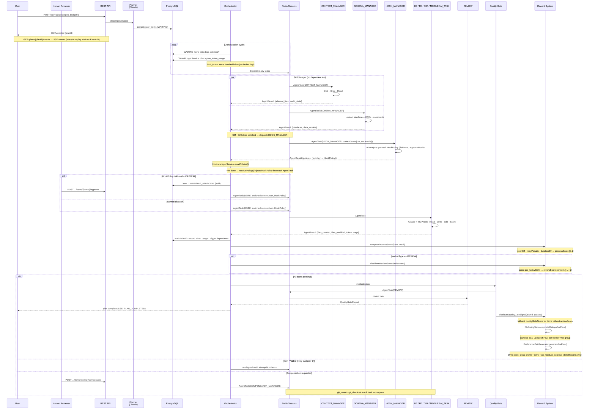

# Agent Framework

Multi-agent orchestration framework for AI-driven software delivery from natural language specifications.

## Status Snapshot

- 41 worker profiles across 7 domain types (BE×14, FE×6, DBA×10, MOBILE×2, AI_TASK, CONTRACT, REVIEW) plus infrastructure workers (CONTEXT_MANAGER, SCHEMA_MANAGER, HOOK_MANAGER, AUDIT_MANAGER, EVENT_MANAGER, TASK_MANAGER, COMPENSATOR_MANAGER, SDK_SCAFFOLD).
- Worker modules generated compile-time from `agents/manifests/*.agent.yml` by `agent-compiler-maven-plugin`.
- Middle-layer worker types (`CONTEXT_MANAGER`, `SCHEMA_MANAGER`) run as plan dependencies before domain workers; they explore the codebase and extract schemas, delivering enriched context via `contextJson` to BE/FE/DBA/MOBILE/AI_TASK workers.
- Context-aware Read enforcement: domain workers may only Read files listed in the `CONTEXT_MANAGER` result (`relevant_files`); enforced at runtime by `PathOwnershipEnforcer.checkReadOwnership()`.
- Hook Manager worker (`HOOK_MANAGER`) sits between `SCHEMA_MANAGER` and domain workers in the pipeline (`CT→CM→SM→HM→BE/FE→RV`); it analyses each downstream task and produces a per-task `HookPolicy` more granular than the worker type alone.
- **Polyglot Header (SKILL.md)**: every worker has a single `.claude/agents/<name>/SKILL.md` file with YAML frontmatter (read by Claude Code CLI/IDE for subagent discovery) and a Markdown body (read by `SkillLoader.java` after stripping the frontmatter). Zero duality: one file, two runtimes.
- Dynamic `HookPolicy`: `HookManagerService` stores the HM worker output and injects the per-task policy into `AgentTask` at dispatch time; `HookPolicyResolver` provides a static fallback by `WorkerType` when HM has not yet run.
- Two built-in worker interceptors: `WorkerMetricsInterceptor` (MDC structured logging + `TASK_START`/`TASK_SUCCESS`/`TASK_FAILURE`, `HIGHEST_PRECEDENCE`) and `ResultSchemaValidationInterceptor` (JSON output validation, fail-open, `LOWEST_PRECEDENCE`).
- Tool access controlled by sealed `ToolAllowlist` interface (`All` | `Explicit`).
- Policy enforcement layer active at runtime: path ownership, context-aware read access, audit logging, tool filtering, tool usage tracking.
- Orchestrator routes by `workerType + workerProfile` using `WorkerProfileRegistry`.
- Messaging is pluggable (`redis` default, `jms`, `servicebus`).
- Structured execution provenance (`Provenance` record) attached to every `AgentResult`: token usage, tools used, prompt/skills hashes, trace correlation, timing.
- Dispatch metadata (`attemptNumber`, `dispatchAttemptId`, `traceId`, `dispatchedAt`) propagated from orchestrator to worker via `AgentTask`.
- REST API with 20+ endpoints: plan CRUD, quality gate, retry, dispatch attempts, snapshots, restore, SSE event streaming, resume, human approval, compensation, council report, issue snapshots, rewards, ELO stats, DPO pairs.
- **Token Budget**: per-plan token ceiling via `PlanRequest.Budget` (onExceeded: `FAIL_FAST` | `NO_NEW_DISPATCH` | `SOFT_LIMIT`); PostgreSQL tracking via `plan_token_usage` table.
- **SSE Event Streaming**: `GET /api/v1/plans/{id}/events` — Server-Sent Events with late-join replay via `Last-Event-ID`; backed by append-only `PlanEvent` log (hybrid event sourcing).
- **Human Approval (AWAITING_APPROVAL)**: tasks with `riskLevel=CRITICAL` are held before dispatch; released via `POST .../items/{itemId}/approve` or failed via `POST .../items/{itemId}/reject`.
- **COMPENSATOR_MANAGER**: saga-based compensating transactions via dedicated worker; triggered via `POST .../items/{itemId}/compensate`.
- **SUB_PLAN**: orchestrator-inline hierarchical sub-plans; depth-guarded (default max-depth: 3); `awaitCompletion` flag controls fire-and-forget vs blocking dispatch.
- **agent-common module**: canonical `HookPolicy`, `ApprovalMode`, `RiskLevel` in `com.agentframework.common.policy` — single source of truth shared by orchestrator and worker-sdk.
- **Reward Signal System**: multi-source Bayesian scoring per `PlanItem` (`reviewScore` weight 0.50 + `processScore` weight 0.30 + `qualityGateScore` fallback 0.20); ELO ratings per worker profile (K=32, chess-like) and DPO preference pairs generated automatically at plan completion. Zero additional LLM calls.
- **GP Engine** (`shared/gp-engine`): Gaussian Process regression module for adaptive worker selection. RBF kernel, Cholesky decomposition, posterior caching (`GpModelCache` with TTL). `TaskOutcomeService` records embedding + GP prediction at dispatch, updates actual reward at completion. `GpWorkerSelectionService` selects optimal profile via UCB (Upper Confidence Bound) exploration-exploitation. Conditional on `gp.enabled=true`.
- **DPO GP Residual**: third preference pair strategy `gp_residual_surprise` — filters cross-profile pairs by GP residual `|actual - predicted|` ≥ 0.15, so the DPO trainer learns from informative surprises rather than obvious outcomes. `gpResidual` field on `PreferencePair` entity stores the informativity score.
- **Council System**: pre-planning advisory sessions with dynamic member selection (`MANAGER` + `SPECIALIST` workers via `COUNCIL_MANAGER`); `CouncilReport` (8-field record) injected into `PlannerService` to guide task decomposition.
- **Missing-Context Feedback Loop**: workers signal `missing_context` in `AgentResult` → orchestrator auto-creates a `CONTEXT_MANAGER` task for the missing files → original item re-dispatched with enriched context.
- **Auto-Retry with Backoff**: `AutoRetryScheduler` polls for failed items with `nextRetryAt` in the past; exponential backoff (`baseDelay × 2^(attempt-1)`); auto-pauses plan after `attemptsBeforePause` failures.
- **TrackerSyncService**: external issue tracker synchronization, controlled by `tracker.sync.enabled` feature-flag (`@ConditionalOnProperty`, disabled by default).
- **RAG Engine** (`shared/rag-engine`): full search pipeline with hybrid search (pgvector + BM25 + RRF fusion), HyDE query transformation, cascade reranking (cosine → LLM), Apache AGE graph services (knowledge_graph + code_graph), parallel enrichment via Java 21 virtual threads; ingestion pipeline with recursive code chunking + proposition chunking; contextual enrichment (Anthropic pattern); pgvector (1024 dim, HNSW); Redis DB 5 embedding cache. Docker: `sol/postgres:pg16-age` + Ollama (`mxbai-embed-large`).

## Architecture



### Pipeline Overview

```text
┌─────────┐     ┌──────────┐     ┌──────────┐
│  User    │────▶│ REST API │────▶│ Planner  │
│ (spec)   │     │ POST /   │     │ (Claude) │
└─────────┘     └──────────┘     └────┬─────┘
                                      │ decompose
                                      ▼
                              ┌───────────────┐
                              │  Plan + Items  │
                              │  (PostgreSQL)  │
                              └───────┬───────┘
                                      │ dispatch ready items
                    ┌─────────────────┼─────────────────┐
                    ▼                 ▼                  ▼
            ┌──────────────┐ ┌──────────────┐   ┌─────────────┐
            │   CONTEXT    │ │    SCHEMA    │   │   (other    │
            │   MANAGER    │ │    MANAGER   │   │   items…)   │
            │ Glob·Grep·   │ │ interfaces·  │   │             │
            │ Read         │ │ DTOs·schemas │   │             │
            └──────┬───────┘ └──────┬───────┘   └─────────────┘
                   │                │
                   └───────┬────────┘
                           ▼
                   ┌──────────────┐
                   │ HOOK MANAGER │
                   │  per-task    │
                   │  HookPolicy  │
                   └──────┬───────┘
                          │
            ┌─────────────┼─────────────────┐
            │             │                 │
            ▼             ▼                 ▼
    ┌─────────────┐ ┌──────────┐   ┌──────────────┐
    │ BE Worker   │ │ FE Worker│   │ DBA / MOBILE │
    │ (14 profiles│ │(6 profs) │   │ AI_TASK /    │
    │  java→ocaml)│ │react→vue │   │ CONTRACT     │
    └──────┬──────┘ └────┬─────┘   └──────┬───────┘
           │             │                │
           └─────────────┼────────────────┘
                         ▼
                 ┌──────────────┐
                 │   REVIEW     │
                 │ Quality Gate │
                 └──────┬───────┘
                        ▼
                ┌───────────────┐
                │ Reward System │
                │  ELO · DPO   │
                └───────────────┘
```

1. `POST /api/v1/plans` creates a plan request (or `GET` to list, `GET /{planId}` to fetch).
2. Planner (Claude + structured output) decomposes into `PlanItem`s.
3. Orchestrator persists plan/items and dispatches tasks asynchronously, populating dispatch metadata (`attemptNumber`, `dispatchAttemptId`, `traceId`, `dispatchedAt`) on each `AgentTask`.
4. Dispatch target is resolved from profile registry:
   - `workerProfile` present -> profile topic/subscription.
   - `workerProfile` absent -> default profile for type, or fallback to `workerType.topicName()`.
5. Workers receive tasks via `WorkerTaskConsumer` and invoke `AbstractWorker.process()`.
6. `WorkerChatClientFactory` builds a `ChatClient` with two-layer tool pipeline:
   - **Allowlist filter** — removes unauthorized tools (LLM never sees them).
   - **Policy decorator** — wraps surviving tools with `PolicyEnforcingToolCallback` for path ownership checks, audit logging, and tool usage tracking.
7. Worker executes task context with Claude + MCP tools, captures `ChatResponse` metadata (token usage), and builds a `Provenance` record with execution details.
8. Worker publishes `AgentResult` (with embedded `Provenance`) back to orchestrator.
9. Orchestrator updates dependencies and triggers quality gate report when terminal.

## Repository Layout

| Path | Purpose |
|---|---|
| `agent-common/` | Shared library: `HookPolicy`, `ApprovalMode`, `RiskLevel` (`com.agentframework.common.policy`) |
| `shared/rag-engine/` | RAG pipeline: ingestion (chunking, contextual enrichment), embedding cache (Redis DB 5), pgvector store (1024 dim, HNSW), search/reranking (Sessione 2) |
| `shared/gp-engine/` | GP regression engine: RBF kernel, Cholesky solver, posterior caching, prediction with uncertainty (Sessione 6) |
| `agents/manifests/` | Source of truth for worker definitions (`*.agent.yml`) |
| `.claude/agents/*/SKILL.md` | Worker system prompts — polyglot header format (YAML frontmatter for Claude Code + Markdown body for Java runtime via `SkillLoader`) |
| `.claude/agents/` | 34 subagent definitions (Claude Code discovery): BE×9 (be, be-go, be-node, be-rust, be-python, be-dotnet, be-kotlin, be-elixir, be-laravel, be-ocaml), FE×3 (fe, fe-nextjs, fe-vue), DBA×10 (dba-postgres thru dba-vectordb), MOBILE×2 (mobile-swift, mobile-kotlin), infra×6 (context-manager, schema-manager, hook-manager, audit-manager, event-manager, review), planner, contract, ai-task |
| `prompts/` | Prompt templates (`plan_tasks`, `quality_gate_report`, etc.) |
| `execution-plane/agent-compiler-maven-plugin/` | Manifest -> worker module generator |
| `execution-plane/worker-sdk/` | `AbstractWorker`, context builder, ChatClient factory, policy enforcement, provenance |
| `execution-plane/workers/` | Generated worker modules |
| `control-plane/orchestrator/` | REST API, planner, orchestration, state persistence |
| `config/worker-profiles.yml` | Profile registry (topic/subscription mapping) |
| `config/agent-registry.yml` | Generated worker metadata registry |
| `config/repo-layout.yml` | Path ownership rules per worker type |
| `messaging/` | Messaging SPI + providers (JMS/Redis/Service Bus) |
| `contracts/` | JSON Schemas, OpenAPI/AsyncAPI, event contracts |

## Active Worker Profiles

41 manifests generating 48 Maven modules (41 generated + 7 manual/special).

### Domain Workers (32 profiles)

| Worker | Type | Profile | Topic | Subscription | Owns Paths |
|---|---|---|---|---|---|
| Backend Java | `BE` | `be-java` | `agent-tasks` | `be-java-worker-sub` | `backend/` |
| Backend Go | `BE` | `be-go` | `agent-tasks` | `be-go-worker-sub` | `backend/` |
| Backend Rust | `BE` | `be-rust` | `agent-tasks` | `be-rust-worker-sub` | `backend/` |
| Backend Node.js | `BE` | `be-node` | `agent-tasks` | `be-node-worker-sub` | `backend/` |
| Backend Python | `BE` | `be-python` | `agent-tasks` | `be-python-worker-sub` | `backend/` |
| Backend .NET | `BE` | `be-dotnet` | `agent-tasks` | `be-dotnet-worker-sub` | `backend/` |
| Backend Kotlin | `BE` | `be-kotlin` | `agent-tasks` | `be-kotlin-worker-sub` | `backend/` |
| Backend Elixir | `BE` | `be-elixir` | `agent-tasks` | `be-elixir-worker-sub` | `backend/` |
| Backend Laravel | `BE` | `be-laravel` | `agent-tasks` | `be-laravel-worker-sub` | `backend/` |
| Backend C++ | `BE` | `be-cpp` | `agent-tasks` | `be-cpp-worker-sub` | `backend/` |
| Backend Quarkus | `BE` | `be-quarkus` | `agent-tasks` | `be-quarkus-worker-sub` | `backend/` |
| Backend OCaml | `BE` | `be-ocaml` | `agent-tasks` | `be-ocaml-worker-sub` | `backend/` |
| Frontend React | `FE` | `fe-react` | `agent-tasks` | `fe-react-worker-sub` | `frontend/` |
| Frontend Angular | `FE` | `fe-angular` | `agent-tasks` | `fe-angular-worker-sub` | `frontend/` |
| Frontend Vue | `FE` | `fe-vue` | `agent-tasks` | `fe-vue-worker-sub` | `frontend/` |
| Frontend Svelte | `FE` | `fe-svelte` | `agent-tasks` | `fe-svelte-worker-sub` | `frontend/` |
| Frontend Next.js | `FE` | `fe-nextjs` | `agent-tasks` | `fe-nextjs-worker-sub` | `frontend/` |
| Frontend Vanilla JS | `FE` | `fe-vanillajs` | `agent-tasks` | `fe-vanillajs-worker-sub` | `frontend/` |
| DBA PostgreSQL | `DBA` | `dba-postgres` | `agent-tasks` | `dba-postgres-worker-sub` | `database/`, `templates/dba/` |
| DBA MySQL | `DBA` | `dba-mysql` | `agent-tasks` | `dba-mysql-worker-sub` | `database/`, `templates/dba/` |
| DBA SQL Server | `DBA` | `dba-mssql` | `agent-tasks` | `dba-mssql-worker-sub` | `database/`, `templates/dba/` |
| DBA Oracle | `DBA` | `dba-oracle` | `agent-tasks` | `dba-oracle-worker-sub` | `database/`, `templates/dba/` |
| DBA MongoDB | `DBA` | `dba-mongo` | `agent-tasks` | `dba-mongo-worker-sub` | `database/`, `templates/dba/` |
| DBA Redis | `DBA` | `dba-redis` | `agent-tasks` | `dba-redis-worker-sub` | `database/`, `templates/dba/` |
| DBA SQLite | `DBA` | `dba-sqlite` | `agent-tasks` | `dba-sqlite-worker-sub` | `database/`, `templates/dba/` |
| DBA Cassandra | `DBA` | `dba-cassandra` | `agent-tasks` | `dba-cassandra-worker-sub` | `database/`, `templates/dba/` |
| DBA Graph DB | `DBA` | `dba-graphdb` | `agent-tasks` | `dba-graphdb-worker-sub` | `database/`, `templates/dba/` |
| DBA Vector DB | `DBA` | `dba-vectordb` | `agent-tasks` | `dba-vectordb-worker-sub` | `database/`, `templates/dba/` |
| Mobile iOS (Swift) | `MOBILE` | `mobile-swift` | `agent-tasks` | `mobile-swift-worker-sub` | `ios/`, `mobile/`, `templates/mobile/` |
| Mobile Android (Kotlin) | `MOBILE` | `mobile-kotlin` | `agent-tasks` | `mobile-kotlin-worker-sub` | `android/`, `mobile/`, `templates/mobile/` |
| AI Task | `AI_TASK` | n/a | `agent-tasks` | `ai-task-worker-sub` | (none) |
| Contract | `CONTRACT` | n/a | `agent-tasks` | `contract-worker-sub` | `contracts/` |

### Infrastructure Workers

| Worker | Type | Profile | Topic | Subscription | Owns Paths |
|---|---|---|---|---|---|
| Review | `REVIEW` | n/a | `agent-reviews` | `review-worker-sub` | (none, read-only) |
| Context Manager | `CONTEXT_MANAGER` | n/a | `agent-tasks` | `context-manager-worker-sub` | (none, read-only) |
| Schema Manager | `SCHEMA_MANAGER` | n/a | `agent-tasks` | `schema-manager-worker-sub` | (none, read-only) |
| Hook Manager | `HOOK_MANAGER` | n/a | `agent-tasks` | `hook-manager-worker-sub` | (none, read-only) |
| Audit Manager | `AUDIT_MANAGER` | n/a | `agent-tasks` | `audit-manager-worker-sub` | `audit/` |
| Event Manager | `EVENT_MANAGER` | n/a | `agent-tasks` | `event-manager-worker-sub` | (none, read-only) |
| Task Manager | `TASK_MANAGER` | n/a | `agent-tasks` | `task-manager-worker-sub` | `issues/` |
| Compensator | `COMPENSATOR_MANAGER` | n/a | `agent-tasks` | `compensator-manager-worker-sub` | `.` |
| SDK Scaffold | `AI_TASK` | `sdk-scaffold` | `agent-tasks` | `sdk-scaffold-worker-sub` | `generated/`, `skills/sdkscaffold/` |
| Sub-Plan | `SUB_PLAN` | — | — | — | — (handled inline by orchestrator) |

### Advisory Workers (Council)

| Worker | Type | Profile | Topic | Subscription | Owns Paths |
|---|---|---|---|---|---|
| Council Manager | `COUNCIL_MANAGER` | n/a | — | — | — (in-process, pre-planning) |
| Manager (Advisory) | `MANAGER` | n/a | `agent-advisory` | — | (none, read-only) |
| Specialist (Advisory) | `SPECIALIST` | n/a | `agent-advisory` | — | (none, read-only) |

`CONTEXT_MANAGER` and `SCHEMA_MANAGER` workers have read-only access to the full repository (`readOnlyPaths: ["."]`). They use `Glob`, `Grep`, and `Read` to explore and produce structured context for downstream workers. Domain workers (BE/FE/AI_TASK) no longer have `Glob` or `Grep` in their allowlist — all file discovery is delegated to these managers.

`HOOK_MANAGER` runs after `SCHEMA_MANAGER` and before domain workers. It receives the CM and SM results as context and produces a `{"policies": {taskKey → HookPolicy}}` map that the orchestrator injects into subsequent `AgentTask` messages. `AUDIT_MANAGER` and `EVENT_MANAGER` are optional plan stages that respectively generate audit reports and react to hook violations.

`COUNCIL_MANAGER` runs in-process (no message broker hop) during pre-planning. It dynamically selects `MANAGER` and `SPECIALIST` advisory workers based on the plan specification, consults them in parallel via the `agent-advisory` topic, and synthesizes their recommendations into a `CouncilReport`. See the [Council System](#council-system-advisory-pre-planning) section below.

All task workers share the unified `agent-tasks` topic. Azure Service Bus routes messages
to the correct worker subscription via SQL filter: multi-stack types (BE, FE) filter on
`workerProfile` property (e.g. `workerProfile = 'be-java'`), single-profile types (AI_TASK,
CONTRACT) filter on `workerType`. The orchestrator resolves default profiles automatically
when the planner doesn't assign one.

Defaults are configured in `config/worker-profiles.yml`:

- `BE -> be-java`
- `FE -> fe-react`
- `DBA -> dba-postgres`
- `MOBILE -> mobile-swift`

## Agent Manifest Format

Worker definitions live in `agents/manifests/*.agent.yml`. Example:

```yaml
apiVersion: agent-framework/v1
kind: AgentManifest

metadata:
  name: be-java-worker
  displayName: "Backend Java Worker (Spring Boot)"
  description: >
    Handles Java/Spring Boot backend tasks.

spec:
  workerType: BE
  workerProfile: be-java
  topic: agent-tasks
  subscription: be-java-worker-sub

  model:
    name: claude-sonnet-4-6
    maxTokens: 16384
    temperature: 0.2

  prompts:
    systemPromptFile: .claude/agents/be/SKILL.md
    skills:
      - skills/springboot-workflow-skills/
      - skills/crosscutting/
    instructions: |
      Implement the backend task using Java and Spring Boot.
    resultSchema: |
      { "files_created": [], "files_modified": [], "summary": "" }

  tools:
    dependencies:
      - io.github.massimilianopili:mcp-devops-tools
      - io.github.massimilianopili:mcp-filesystem-tools
      - io.github.massimilianopili:mcp-sql-tools
    allowlist:
      - Read
      - Write
      - Edit
      - Bash
    # Note: Glob and Grep are NOT listed — domain workers delegate file discovery
    # to CONTEXT_MANAGER and SCHEMA_MANAGER dependency tasks.
    mcpServers:
      - git
      - repo-fs
      - openapi
      - test

  ownership:
    ownsPaths:
      - backend/
    readOnlyPaths: []
    # readOnlyPaths is empty: contracts are delivered via SCHEMA_MANAGER contextJson.
    # Context-aware Read enforcement is applied at runtime by PathOwnershipEnforcer.

  concurrency:
    maxConcurrentCalls: 3
```

Key sections:

- `spec.tools.allowlist` — compile-time tool filtering via `ToolAllowlist.Explicit`; domain workers omit `Glob`/`Grep` (delegated to `CONTEXT_MANAGER`/`SCHEMA_MANAGER`)
- `spec.ownership.ownsPaths` — runtime write enforcement via `PolicyProperties`
- `spec.ownership.readOnlyPaths` — additional readable paths (empty for domain workers; `["."]` for `CONTEXT_MANAGER`)
- `spec.tools.dependencies` — Maven coordinates of MCP tool starters added to generated `pom.xml`
- `spec.tools.mcpServers` — logical MCP server names (from `mcp/registry/mcp-registry.yml`); when `SPRING_PROFILES_ACTIVE=mcp`, the worker connects to these servers via SSE transport instead of using in-process tool libraries

## Agent Compiler Plugin

The plugin lives in `execution-plane/agent-compiler-maven-plugin` and provides three goals:

| Goal | Phase | Description |
|---|---|---|
| `generate-workers` | `generate-sources` | Generates complete Maven modules from manifests |
| `validate-manifests` | `validate` | Validates manifest YAML without generating output |
| `generate-registry` | `generate-resources` | Generates `worker-profiles.yml` and `agent-registry.yml` |

### Typical Workflow

```bash
# Single-command build (generate worker modules + full reactor compile)
./build.sh -DskipTests

# Or manually:
# Build/install the plugin artifact locally
mvn -pl execution-plane/agent-compiler-maven-plugin -am install -DskipTests

# Validate manifests (CI gate)
mvn com.agentframework:agent-compiler-maven-plugin:1.0.0-SNAPSHOT:validate-manifests

# Regenerate worker modules + registries
mvn com.agentframework:agent-compiler-maven-plugin:1.0.0-SNAPSHOT:generate-workers
mvn com.agentframework:agent-compiler-maven-plugin:1.0.0-SNAPSHOT:generate-registry
```

Generated artifacts per worker module:

- `src/main/java/.../XxxWorker.java` — `AbstractWorker` subclass with tool allowlist, skills, instructions
- `src/main/java/.../XxxWorkerApplication.java` — Spring Boot entry point
- `src/main/resources/application.yml` — Spring config with model, messaging, and policy settings
- `src/main/resources/application-mcp.yml` — Spring AI MCP client config (activated via `mcp` profile); only generated when `mcpServers` is declared in the manifest
- `pom.xml` — Maven descriptor with tool dependencies (includes `spring-ai-starter-mcp-client` when `mcpServers` is present)
- `Dockerfile` — Container image build descriptor

## Policy Enforcement

The policy layer in `worker-sdk` enforces security policies at Java runtime, independent of Claude Code hooks. Active when `agent.worker.policy.enabled=true` (default).

### Components

| Class | Package | Purpose |
|---|---|---|
| `ToolAllowlist` | `worker` | Sealed interface: `All` (default) or `Explicit(List<String>)` |
| `PolicyProperties` | `worker.policy` | `@ConfigurationProperties` for `agent.worker.policy.*` |
| `PathOwnershipEnforcer` | `worker.policy` | Validates write-tool paths against `ownsPaths`; also enforces context-aware Read restriction (`checkReadOwnership()`) when `relevantFiles` is set |
| `ToolAuditLogger` | `worker.policy` | Structured logging via `audit.tools` logger with MDC |
| `PolicyEnforcingToolCallback` | `worker.policy` | Decorator wrapping each `ToolCallback` with ownership + audit + tool usage tracking |
| `PolicyAutoConfiguration` | `worker.policy` | Auto-config with `@ConditionalOnProperty` gate |
| `HashUtil` | `worker.util` | SHA-256 hashing for prompt/skills content fingerprinting |

### How It Works

```
ToolCallbackProvider[n] (from classpath: mcp-filesystem-tools, mcp-devops-tools, ...)
         |
         v
WorkerChatClientFactory.create(workerType, toolAllowlist)
  1. Allowlist filter  -->  ToolCallback[m]  (m <= n, unauthorized removed)
  2. Policy decorator  -->  PolicyEnforcingToolCallback[m]  (wrapped)
         |
         v
ChatClient with only authorized, policy-enforced tools
```

### Enforcement Behavior

- **Path ownership**: write tools (Write, Edit) targeting paths outside `ownsPaths` return `{"error":true,"message":"..."}` — the LLM can adapt.
- **Context-aware Read access**: when a `CONTEXT_MANAGER` result is present in `contextJson`, domain workers may only Read files listed in `relevant_files` (plus their own `ownsPaths`). Enforced via `PolicyEnforcingToolCallback` → `PathOwnershipEnforcer.checkReadOwnership()`. Fail-open: if the path cannot be extracted, the Read is allowed.
- **Audit logging**: every tool call logged to `audit.tools` logger with outcome (`SUCCESS`/`FAILURE`/`DENIED`), timing, and MDC context.
- **Tool usage tracking**: `PolicyEnforcingToolCallback` records tool names per-task via `ThreadLocal` — drained by `AbstractWorker` to populate `Provenance.toolsUsed`.
- **Fail-open**: if tool input cannot be parsed, the operation is allowed (filesystem `base-dir` remains the hard boundary).

### Task-Level HookPolicy (Dynamic)

When a `HOOK_MANAGER` task completes, `HookManagerService.storePolicies()` parses its
`{"policies": {taskKey → HookPolicy}}` output. At each subsequent dispatch,
`resolvePolicy()` looks up the per-task `HookPolicy` and injects it into the `AgentTask`
message. `PolicyEnforcingToolCallback` reads it from `TASK_POLICY` ThreadLocal (highest priority).

**Fallback chain**: `HookPolicy` (task-level, from HM worker) → `HookPolicyResolver` (per `WorkerType`, static) → `PolicyProperties` (application.yml).

`HookPolicy` fields (11 total — defined in `agent-common`, `com.agentframework.common.policy`):
- `allowedTools` — tool names this task may call (empty = inherit static config)
- `ownedPaths` — file path prefixes this task may write to (empty = inherit static config)
- `allowedMcpServers` — MCP server names allowed for this task
- `auditEnabled` — whether audit logging is required
- `maxTokenBudget` — per-task token ceiling; overrides plan-level budget (nullable)
- `allowedNetworkHosts` — outbound network hosts (e.g. `api.github.com`); empty = no restriction
- `requiredHumanApproval` — `ApprovalMode`: `NONE` (default) / `BLOCK` / `NOTIFY_TIMEOUT`
- `approvalTimeoutMinutes` — minutes to hold for approval when mode is `NOTIFY_TIMEOUT`
- `riskLevel` — `RiskLevel`: `LOW` / `MEDIUM` / `HIGH` / `CRITICAL` (CRITICAL → AWAITING_APPROVAL)
- `estimatedTokens` — estimated token consumption for pre-dispatch budget checks (nullable)
- `shouldSnapshot` — capture workspace snapshot before execution (rollback + audit)

### Defense-in-Depth

| Scenario | Shell Hooks (Tier 1) | Java Policy Layer | HookPolicy (Tier 2) |
|---|---|---|---|
| Dev: Claude Code | Active | Active | Active (if HM completed) |
| Dev: `mvn spring-boot:run` | Not active | **Active** | **Active** |
| Prod: Docker container | Not active | **Active** | **Active** |

Tier 1 = shell hooks in `.claude/settings.json` (planner-level, static, enforced by `enforce-tool-allowlist.sh`).
Tier 2 = `HookPolicy` record embedded in `AgentTask` (per-task, dynamic, from `HOOK_MANAGER` worker).

### Configuration (generated in `application.yml`)

```yaml
agent.worker.policy:
  enabled: true
  worker-profile: be-java
  owns-paths:
    - backend/
  write-tool-names:
    - Write
    - Edit
  audit:
    enabled: true
    include-input: false
    max-input-length: 200
```

Override at deploy time via env vars: `AGENT_WORKER_POLICY_OWNS_PATHS_0=backend/`.

## MCP Client Mode

Workers can consume tools in two modes, selectable at deploy time via Spring Boot profiles:

### Mode A: In-Process (default)

Tool libraries are embedded in the worker JVM as Maven dependencies (`mcp-devops-tools`, `mcp-filesystem-tools`, etc.). Their `@ReactiveTool` beans are classpath-scanned and registered as `ToolCallbackProvider` beans. This is the default behavior when no `mcp` profile is active.

### Mode B: External MCP Server (profile `mcp`)

Workers connect to external MCP server(s) via SSE transport. Spring AI's `spring-ai-starter-mcp-client` auto-registers `SyncMcpToolCallbackProvider` beans that implement `ToolCallbackProvider` — they enter the `WorkerChatClientFactory` pipeline identically to in-process tools. Allowlist filtering and `PolicyEnforcingToolCallback` work without changes.

Activated with `SPRING_PROFILES_ACTIVE=mcp`.

```
Worker JVM                              External MCP Server
  |                                       |
  +-- spring-ai-starter-mcp-client        +-- @ReactiveTool beans
  |       SSE connection ----------------->      (all tools)
  |       SyncMcpToolCallbackProvider     |
  |                                       +-- /sse endpoint
  +-- WorkerChatClientFactory (unchanged)
  |       allowlist filter -> PolicyEnforcingToolCallback wrapper
  |
  v
ChatClient -> Claude -> tool calls -> SSE -> MCP server -> results
```

### Mode C: Hybrid (profile `mcp` + partial in-process)

Some tools come from external MCP servers, others remain in-process. The compiler generates `application-mcp.yml` with `spring.autoconfigure.exclude` entries only for packages whose ALL servers are covered by MCP connections. Tools from uncovered packages stay in-process.

```
Worker JVM                              External MCP Server
  |                                       |
  +-- In-process tools (e.g., sql)        +-- MCP tools (e.g., git, repo-fs)
  |       ToolCallbackProvider            |       via SSE
  |                                       |
  +-- SyncMcpToolCallbackProvider -------->
  |
  +-- WorkerChatClientFactory (both providers merged, zero duplicates)
  |
  v
ChatClient -> Claude -> tool calls -> in-process OR SSE -> results
```

### Activation

| Variable | Description |
|----------|-------------|
| `SPRING_PROFILES_ACTIVE=mcp` | Enable MCP client mode |
| `MCP_GIT_URL` | Override git server URL (default: `http://mcp-server:8080`) |
| `MCP_REPO_FS_URL` | Override repo-fs server URL |
| `MCP_OPENAPI_URL` | Override openapi server URL |
| `MCP_TEST_URL` | Override test server URL |
| `MCP_AZURE_URL` | Override azure server URL |

Without the `mcp` profile, all tools run in-process (Mode A) — zero behavioral change.

### Deduplication

When Mode C (hybrid) is active, the compiler excludes in-process auto-configurations for packages fully covered by MCP connections. For example, if `be-java-worker` declares `mcpServers: [git, repo-fs, openapi, test]` and `git`, `openapi`, `test` all map to `mcp-devops-tools`, but `azure` (same package) is missing, only `FileSystemToolsAutoConfiguration` is excluded — `DevOpsToolsAutoConfiguration` stays in-process because `azure` is not covered.

**Rule**: exclude a package's auto-configuration only if ALL servers mapping to that package are in the worker's `mcpServers` list.

For full architecture diagrams and MCP server setup: [MCP Usage Guide](mcp/docs/usage.md).

## Messaging SPI

Transport-agnostic messaging with three provider implementations:

| Provider | Module | Activation |
|---|---|---|
| Redis Streams | `messaging/messaging-redis` | default (`messaging.provider=redis`) |
| JMS (Artemis) | `messaging/messaging-jms` | `spring.profiles.active=jms` |
| Azure Service Bus | `messaging/messaging-servicebus` | `spring.profiles.active=servicebus` |

Core abstractions in `messaging/messaging-api`:

- `MessageEnvelope` — transport-agnostic message carrier (messageId, destination, body, properties)
- `MessageSender` — send interface
- `MessageListenerContainer` — subscription lifecycle (subscribe, start, stop)
- `MessageHandler` — callback functional interface

## Advanced Features

### SSE Event Streaming

`GET /api/v1/plans/{planId}/events` returns a Server-Sent Event stream. Each event corresponds
to a state transition recorded in the append-only `PlanEvent` log.

**Late-join replay**: clients that reconnect (or join after plan start) pass the `Last-Event-ID`
header with the last received `sequenceNumber`. The `SseEmitterRegistry` replays all `PlanEvent`
records with a higher sequence number before attaching the live stream. This means no events are
missed across reconnects.

```bash
curl -N http://localhost:8080/api/v1/plans/{planId}/events
# Or resume from event #5:
curl -N -H "Last-Event-ID: 5" http://localhost:8080/api/v1/plans/{planId}/events
```

Event types: `PLAN_STARTED`, `PLAN_PAUSED`, `PLAN_RESUMED`, `TASK_DISPATCHED`,
`TASK_COMPLETED`, `TASK_FAILED`, `PLAN_COMPLETED`.

### Token Budget

Attach a budget to any plan to cap total token consumption:

```json
{
  "spec": "Build a REST API",
  "budget": {
    "maxTotalTokens": 100000,
    "onExceeded": "FAIL_FAST",
    "perWorkerType": { "BE": 40000, "FE": 20000 }
  }
}
```

`onExceeded` values:
- `FAIL_FAST` — transition plan to FAILED immediately on budget breach.
- `NO_NEW_DISPATCH` — stop dispatching new items; let in-flight items complete.
- `SOFT_LIMIT` — log warning only; continue execution.

Token consumption is tracked in `plan_token_usage` (PostgreSQL). Each `AgentResult` carries
`Provenance.tokenUsage`; `TokenBudgetService` aggregates and enforces per-plan and per-worker-type
limits before each dispatch.

### Missing-Context Feedback Loop

When a worker cannot complete a task because it lacks necessary context (e.g. unknown interfaces,
missing file references), it signals `missing_context` in the `AgentResult` along with a list of
files or symbols it needs.

The orchestrator handles this automatically:
1. `extractMissingContext(result)` parses the missing file paths from the worker output.
2. `handleMissingContext(item, missingFiles)` creates a new `CONTEXT_MANAGER` task scoped to the
   missing files — the CM worker explores and returns the needed content.
3. The original item's `contextJson` is enriched with the new CM result and the item is
   re-dispatched to the same worker.
4. `PlanItem.contextRetries` tracks how many context-enrichment cycles have occurred (capped to
   prevent infinite loops).

This eliminates the need for workers to have `Glob`/`Grep` tools — if context is insufficient,
the framework automatically supplies more.

### Auto-Retry with Exponential Backoff

Failed items are not immediately abandoned. `AutoRetryScheduler` (a `@Scheduled` component) polls
for items in `FAILED` status whose `nextRetryAt` timestamp has passed:

- **Backoff formula**: `baseDelay × 2^(attemptNumber - 1)` — e.g. 30s, 60s, 120s, 240s.
- **Retry limit**: configurable per plan via `maxRetries` (default: 3).
- **Auto-pause**: after `attemptsBeforePause` consecutive failures on the same item, the plan
  transitions to `PAUSED` status. This prevents runaway retries consuming budget.
- **Manual resume**: `POST /api/v1/plans/{planId}/resume` transitions a PAUSED plan back to
  RUNNING and re-dispatches eligible items.

The scheduler runs on a fixed interval (default: 30s) and processes all eligible items across
all active plans in a single sweep.

### Human Approval (AWAITING_APPROVAL)

When the `HOOK_MANAGER` assigns `riskLevel=CRITICAL` or `requiredHumanApproval=BLOCK` to a task,
the orchestrator transitions that `PlanItem` to `AWAITING_APPROVAL` instead of dispatching it.
The plan continues executing other independent items while the high-risk item waits.

**Approve** (releases item to WAITING → dispatch):
```bash
POST /api/v1/plans/{planId}/items/{itemId}/approve
```

**Reject** (marks item FAILED):
```bash
POST /api/v1/plans/{planId}/items/{itemId}/reject
{"reason": "Deployment to prod not authorized yet"}
```

`requiredHumanApproval=NOTIFY_TIMEOUT` auto-fails the item after `approvalTimeoutMinutes` if
no human acts.

### COMPENSATOR_MANAGER

The `COMPENSATOR_MANAGER` worker performs saga-style compensating transactions to undo the
effects of a failed or unwanted task. It uses git-based MCP tools (`git_revert`, `git_stash`,
`git_checkout`) to roll back file changes captured in a workspace snapshot.

Trigger compensation for any terminal item:
```bash
POST /api/v1/plans/{planId}/items/{itemId}/compensate
{"reason": "Rolling back BE-003 due to security review failure"}
```

The orchestrator creates a new `PlanItem` of type `COMPENSATOR_MANAGER`, which the dedicated
worker picks up. If `shouldSnapshot=true` was set in `HookPolicy`, a snapshot was captured before
execution and the compensator can restore it.

### Reward Signal System

After each plan completes, the framework automatically computes a multi-source reward signal
for every `PlanItem` — zero additional LLM calls. The signal drives ELO ratings per worker
profile and generates DPO preference pairs for offline fine-tuning.

#### Reward sources

| Source | Weight | When available |
|--------|--------|----------------|
| `reviewScore` | 0.50 | After REVIEW worker completes (parsed from `per_task` JSON or global `severity`) |
| `processScore` | 0.30 | Immediately after each DONE transition (deterministic from `Provenance`) |
| `qualityGateScore` | 0.20 | After plan completion — fallback for items without `reviewScore` |

Weights are re-normalised when sources are unavailable (e.g. plan without a REVIEW task).

**processScore formula** (deterministic, no LLM):
```
tokenEff     = 1 / log₁₀(tokensUsed + 10)    — penalises verbosity logarithmically
retryPenalty = max(0, 1 − retries × 0.25)    — each context retry costs 0.25 points
durationEff  = sigmoid(−(ms − 60_000)/30_000) — ≈1.0 if <1 min, ≈0.5 at 2 min, ≈0 after 5 min
processScore = tokenEff×0.4 + retryPenalty×0.3 + durationEff×0.3
```

#### ELO ratings (`/api/v1/rewards/stats`)

`EloRatingService` runs once per plan after all rewards are assigned. Profiles that executed
tasks of the same `workerType` within the plan are compared pairwise (K=32, chess-like ELO,
starting rating: 1600).

```bash
GET /api/v1/rewards/stats
# → [{"workerProfile":"be-java","eloRating":1643,"matchCount":12,"avgReward":0.78}]
```

#### DPO preference pairs (`/api/v1/rewards/preference-pairs`)

`PreferencePairGenerator` produces pairs via three strategies:
- **same_plan_cross_profile** — two profiles competing on the same `workerType` within the same plan
- **retry_comparison** — failed attempt (missing_context) vs successful retry of the same item
- **gp_residual_surprise** — cross-profile pairs filtered by GP residual `|actual_reward - gp_predicted|` ≥ 0.15; only generated when `gp.enabled=true` and GP data is available. The `gpResidual` field stores `max(residualA, residualB)` as informativity score.

Only pairs with `deltaReward ≥ 0.3` are persisted (near-identical pairs degrade preference learning).

```bash
GET /api/v1/rewards/preference-pairs?minDelta=0.3&limit=500
# → NDJSON: {"prompt":"…","chosen":"…","rejected":"…","deltaReward":0.55,…}

GET /api/v1/rewards?planId={planId}
# → NDJSON: {"taskKey":"BE-001","aggregatedReward":0.72,"reviewScore":0.8,"processScore":0.6,…}
```

### SUB_PLAN (Hierarchical Plans)

A `PlanItem` of type `SUB_PLAN` is handled inline by the orchestrator — no message broker hop.
When the item is ready for dispatch, `OrchestrationService.handleSubPlan()`:
1. Validates depth (`plan.depth < maxDepth`; default: 3 levels).
2. Calls `PlannerService.decompose(subPlanSpec)` to create a child `Plan`.
3. Stores `childPlanId` on the parent item.
4. If `awaitCompletion=true`: transitions item to `DISPATCHED` and waits for the
   `PlanCompletedEvent`; marks item DONE/FAILED when child terminates.
5. If `awaitCompletion=false`: marks item DONE immediately (fire-and-forget).

The `@EventListener onChildPlanCompleted()` in `OrchestrationService` handles the async
notification when a child plan reaches a terminal state.

### Council System (Advisory Pre-Planning)

Before the planner decomposes a specification into tasks, an optional **council session** consults
domain-expert advisory workers to gather architectural insights, security considerations, and
testing strategy recommendations.

**How it works:**

1. `CouncilService.runPrePlanningSession(spec)` analyses the specification and dynamically selects
   relevant council members from two pools:
   - **MANAGER** workers — domain-level architectural advisors (4 roles: backend, frontend, security, data)
   - **SPECIALIST** workers — cross-cutting experts (7 roles: database, auth, api, testing, seo, infra, network)
2. Selected members are consulted in parallel via the `agent-advisory` topic (handled by the
   `AdvisoryWorker`). Each member receives the spec + a role-specific prompt loaded by
   `CouncilPromptLoader` from `resources/prompts/council/`.
3. The `COUNCIL_MANAGER` synthesizes all advisory responses into a `CouncilReport` record:

| CouncilReport field | Description |
|---------------------|-------------|
| `architectureDecisions` | Key architectural choices and rationale |
| `securityConsiderations` | Security risks and mitigations |
| `testingStrategy` | Recommended testing approach |
| `performanceConsiderations` | Performance risks and optimizations |
| `dataModelDecisions` | Data model design choices |
| `infrastructureNotes` | Deployment and infrastructure guidance |
| `crossCuttingConcerns` | Logging, monitoring, error handling patterns |
| `summary` | Executive summary of all recommendations |

4. The report is persisted on the `Plan` entity (`council_report` TEXT column, Flyway V13) and
   injected into `PlannerService.decompose()` to guide task decomposition.

**Configuration** (`application.yml`):
```yaml
council:
  enabled: true
  max-members: 6
  pre-planning-enabled: true
  task-session-enabled: false    # per-task sessions (optional, higher cost)
```

**Task-level sessions** (when `task-session-enabled=true`): `CouncilService.runTaskSession(item)`
can also be called during plan execution for complex individual tasks, providing targeted advice
before dispatch.

**Endpoint**: `GET /api/v1/plans/{planId}/council-report` returns the stored report (200 JSON,
204 if council was disabled, 404 if plan not found).

### agent-common Module

`agent-common` is a pure-Java library (no Spring) that holds the types shared between the
orchestrator (control-plane) and worker-sdk (execution-plane):

| Type | Package | Description |
|------|---------|-------------|
| `HookPolicy` | `com.agentframework.common.policy` | 11-field record: policy for a single task |
| `ApprovalMode` | `com.agentframework.common.policy` | `NONE` / `BLOCK` / `NOTIFY_TIMEOUT` |
| `RiskLevel` | `com.agentframework.common.policy` | `LOW` / `MEDIUM` / `HIGH` / `CRITICAL` |

The old definitions in `com.agentframework.orchestrator.hooks` and
`com.agentframework.worker.policy` are `@Deprecated` stubs kept for source compatibility;
they will be removed in a future release.

## Local Development

### Prerequisites

- Java 21 (virtual threads, sequenced collections)
- Maven 3.9+
- Docker (for Postgres + Redis in dev)
- `ANTHROPIC_API_KEY`

### Start Dependencies

```bash
# Local development (Redis Streams DB 3 + PostgreSQL)
docker compose -f docker/docker-compose.dev.yml up -d postgres redis

# SOL server (uses shared Redis + shared Docker network)
docker compose -f docker/docker-compose.sol.yml --env-file docker/sol.env up -d
```

### Run Orchestrator

```bash
cd control-plane/orchestrator
mvn spring-boot:run -Dspring-boot.run.profiles=dev
```

### Submit a Plan

```bash
curl -X POST http://localhost:8080/api/v1/plans \
  -H "Content-Type: application/json" \
  -d '{"spec":"Build a REST API for user management"}'
```

### API Endpoints

| Method | Path | Description |
|---|---|---|
| `POST` | `/api/v1/plans` | Create and start a new plan |
| `GET` | `/api/v1/plans/{planId}` | Get plan status and items |
| `GET` | `/api/v1/plans/{planId}/quality-gate` | Get quality gate report |
| `POST` | `/api/v1/plans/{planId}/resume` | Resume a PAUSED plan |
| `GET`  | `/api/v1/plans/{planId}/events` | SSE stream of plan events (late-join replay via `Last-Event-ID`) |
| `GET`  | `/api/v1/plans/{planId}/graph` | Visual DAG (`?format=mermaid\|json`) |
| `POST` | `/api/v1/plans/{planId}/items/{itemId}/retry` | Retry a failed plan item |
| `POST` | `/api/v1/plans/{planId}/items/{itemId}/approve` | Approve AWAITING_APPROVAL item (→ WAITING) |
| `POST` | `/api/v1/plans/{planId}/items/{itemId}/reject` | Reject AWAITING_APPROVAL item (→ FAILED) |
| `POST` | `/api/v1/plans/{planId}/items/{itemId}/compensate` | Start compensating transaction via COMPENSATOR_MANAGER |
| `GET` | `/api/v1/plans/{planId}/items/{itemId}/attempts` | List dispatch attempts for an item |
| `GET` | `/api/v1/plans/{planId}/snapshots` | List plan snapshots |
| `POST` | `/api/v1/plans/{planId}/restore/{snapshotId}` | Restore plan from snapshot |
| `POST` | `/audit/events` | Receive audit event from `audit-log.sh` (AuditManagerService) |
| `GET`  | `/audit/events?taskKey=` | Query stored audit events |
| `POST` | `/events/violation` | Receive hook violation event from shell script (EventManagerService) |
| `GET`  | `/events/violations?taskKey=` | Query violations per task |
| `GET`  | `/events/health` | Violation count summary |
| `GET` | `/api/v1/rewards` | Per-task reward records, NDJSON (`?planId=` optional) |
| `GET` | `/api/v1/rewards/stats` | ELO leaderboard per worker profile (JSON) |
| `GET` | `/api/v1/rewards/preference-pairs` | DPO preference pairs, NDJSON (`?minDelta=0.3&limit=500`) |
| `GET` | `/api/v1/plans/{planId}/council-report` | Get pre-planning council advisory report |
| `PUT` | `/api/v1/plans/{planId}/items/{itemId}/issue-snapshot` | Store issue snapshot from TASK_MANAGER |

Attempts and snapshots endpoints return DTOs (`DispatchAttemptResponse`, `PlanSnapshotResponse`), not JPA entities.

## Prompt and Skill Resource Loading

### Orchestrator prompts

`PromptLoader` loads from classpath paths:

- `prompts/planner.agent.md`
- `prompts/review.agent.md`
- `prompts/plan_tasks.prompt.md`
- `prompts/quality_gate_report.prompt.md`

### Worker system prompts / skills

`SkillLoader` resolution order:

1. `${FS_SKILLS_DIR}/<resourcePath>` (filesystem override — default in production; set to repository root)
2. classpath fallback (files packaged in the worker JAR)

**Frontmatter stripping**: if a file starts with `---`, `SkillLoader.stripFrontmatter()` automatically removes the YAML frontmatter block before passing the content to the LLM. This allows `.claude/agents/*/SKILL.md` files to contain both the Claude Code configuration (frontmatter) and the Java LLM system prompt (body) in a single file.

Worker manifests reference prompts as `.claude/agents/<name>/SKILL.md`. Ensure `FS_SKILLS_DIR` points to the repository root (e.g., `FS_SKILLS_DIR=/workspace/agent-framework`) so `SkillLoader` resolves `.claude/agents/be/SKILL.md` as `$FS_SKILLS_DIR/.claude/agents/be/SKILL.md`.

## Claude Code Subagents — Polyglot Header

Every worker type has a subagent definition in `.claude/agents/<name>/SKILL.md`.
The same file serves as both a **Claude Code subagent** and a **Java LLM system prompt**:

```
.claude/agents/<name>/SKILL.md
        │
        ├── YAML Frontmatter  (--- ... ---)
        │         └── Read by: Claude Code CLI / IDE  (subagent discovery)
        │               fields: name, description, tools, model, permissionMode, hooks
        │
        └── Markdown Body
                  └── Read by: Java runtime via SkillLoader
                        (stripFrontmatter() removes the frontmatter, passes the body to the LLM)
```

### Worker categories

| Category | Workers | `permissionMode` | Hooks |
|----------|---------|-----------------|-------|
| **Write-capable** | `be`, `be-go`, `be-node`, `be-rust`, `be-python`, `be-dotnet`, `be-kotlin`, `be-elixir`, `be-laravel`, `be-ocaml`, `fe`, `fe-nextjs`, `fe-vue`, `dba-*` (×10), `mobile-swift`, `mobile-kotlin`, `contract`, `ai-task` | — | `enforce-ownership.sh` on `Edit\|Write`; `enforce-mcp-allowlist.sh` on `mcp__.*` |
| **Read-only** | `context-manager`, `schema-manager`, `review`, `planner`, `hook-manager`, `event-manager` | `plan` | none (plan mode blocks all writes) |
| **Audit-write** | `audit-manager` | — | `enforce-ownership.sh` (writes only to `audit/`) |

### Hook pattern for write-capable workers

```yaml
hooks:
  PreToolUse:
    - matcher: "Edit|Write"
      hooks:
        - type: command
          command: "AGENT_WORKER_TYPE=BE $CLAUDE_PROJECT_DIR/.claude/hooks/enforce-ownership.sh"
    - matcher: "mcp__.*"
      hooks:
        - type: command
          command: "AGENT_WORKER_TYPE=BE $CLAUDE_PROJECT_DIR/.claude/hooks/enforce-mcp-allowlist.sh"
```

`enforce-ownership.sh` reads `config/generated/hooks-config.json` to determine allowed paths for each `AGENT_WORKER_TYPE`. If the variable is unset, the script exits 0 (dev mode — allows all).

### Adding a new worker

1. Create `.claude/agents/<name>/SKILL.md` with YAML frontmatter + Markdown system prompt.
2. Create `agents/manifests/<name>.agent.yml` with `systemPromptFile: .claude/agents/<name>/SKILL.md`.
3. Add the new `workerType` entry to `config/generated/hooks-config.json`.
4. Run `mvn generate-workers` to generate the Java worker module.

---

## Test Coverage

416 unit tests across 35 test classes (JUnit 5 + Mockito):

### Orchestrator (255 tests, 17 classes)

| Test Class | Tests | Scope |
|-----------|-------|-------|
| `RewardComputationServiceTest` | 45 | processScore, reviewScore, qualityGate, Bayesian aggregation |
| `OrchestrationServiceTest` | 29 | createAndStart, onTaskCompleted, missing-context, SUB_PLAN, approval, compensation |
| `CouncilServiceTest` | 23 | pre-planning, task sessions, member selection, synthesis, feature flags, executor bounds |
| `WorkerProfileRegistryTest` | 18 | profile lookup, multi-profile types, fallback routing |
| `PlanGraphServiceTest` | 17 | Mermaid/JSON DAG, edge labels, duration formatting |
| `TokenBudgetServiceTest` | 15 | FAIL_FAST, NO_NEW_DISPATCH, SOFT_LIMIT enforcement |
| `SseEmitterRegistryTest` | 15 | subscribe, late-join replay, broadcast, dead emitter cleanup |
| `QualityGateServiceTest` | 10 | async annotations, report generation, reward signals, error handling |
| `EloRatingServiceTest` | 10 | pairwise ELO, multi-type, new profile bootstrap |
| `PreferencePairGeneratorTest` | 11 | cross-profile, retry, gp_residual_surprise, integration (3 strategies combined) |
| `PlanSnapshotServiceTest` | 9 | restore COMPLETED→RUNNING, mixed states, forceStatus validation |
| `PlanEventStoreTest` | 7 | sequence numbering, payload serialization, error fallback |
| `PromptLoaderTest` | 5 | classpath loading, caching, missing resource validation |
| `AutoRetrySchedulerTest` | 5 | eligibility, retry timing, error isolation |
| `RalphLoopServiceTest` | 8 | quality gate feedback loop, retry tracking |
| `CouncilRagEnricherTest` | 8 | RAG enrichment for council sessions |

### GP Engine (30 tests, 5 classes)

| Test Class | Tests | Scope |
|-----------|-------|-------|
| `GaussianProcessEngineTest` | 8 | fit, predict, prior, edge cases |
| `GpModelCacheTest` | 6 | put/get, TTL expiry, invalidation |
| `RbfKernelTest` | 6 | kernel matrix, hyperparameters, edge cases |
| `CholeskyDecompositionTest` | 5 | decompose, solve, positive-definite check |
| `DenseMatrixTest` | 5 | multiply, transpose, toArray |

### RAG Engine (113 tests, 21 classes)

| Test Class | Tests | Scope |
|-----------|-------|-------|
| `RecursiveCodeChunkerTest` | 8 | language support, method boundary split, overlap, token estimate |
| `CodeChunkTest` | 8 | enrichedContent, metadata, IngestionReport, SearchResult, SearchFilters |
| `HybridSearchServiceTest` | 7 | vector search, BM25, RRF fusion, error handling, parallel |
| `CascadeRerankerTest` | 6 | 2-stage cascade, empty/single, stage1TopK, finalTopK, order |
| `PropositionChunkerTest` | 6 | markdown headings, yaml, doc type classification |
| `IngestionPipelineTest` | 6 | ingest, empty list, error recording, enricher, multi-doc |
| `CodeDocumentReaderTest` | 6 | read java, skip unsupported/.git/large, extension mapping, Dockerfile |
| `RagSearchServiceTest` | 6 | full pipeline, no HyDE, original query to reranker, filters, mode |
| `KnowledgeGraphServiceTest` | 6 | add chunk/concept, edges, find related, error, Cypher injection |
| `CodeGraphServiceTest` | 6 | class node, import edge, find by name, extract package/classes, populate |
| `RagPropertiesTest` | 5 | default values, custom overrides, nested records |
| `MetadataEnricherTest` | 5 | java entities, keyphrases, code/ADR classification |
| `EmbeddingCacheServiceTest` | 5 | SHA-256 consistency, hex format, unicode |
| `LlmRerankerTest` | 5 | parallel scoring, parse numeric, fallback, clamp, LLM error |
| `HydeQueryTransformerTest` | 4 | transform, error fallback, disabled, empty query |
| `ContextualEnricherTest` | 4 | enrich prefix, empty input, fallback, truncation |
| `GraphRagServiceTest` | 4 | parallel cross-graph, empty, null/blank query, correlate |
| `CosineRerankerTest` | 3 | rescore + sort, topK limit, empty candidates |

```bash
# Run all tests (orchestrator + dependencies: common, messaging, rag-engine, gp-engine)
mvn clean test -pl control-plane/orchestrator -am

# Run orchestrator tests only
cd control-plane/orchestrator && mvn test

# Run GP engine tests only
cd shared/gp-engine && mvn test

# Run RAG engine tests only
cd shared/rag-engine && mvn test
```

## Known Gaps

- `Provenance.model` field is populated as `null` — requires extracting model identifier from `ChatResponse` metadata (Spring AI does not expose it uniformly across providers yet).

## Tech Stack

- Java 21 (virtual threads, sequenced collections)
- Spring Boot 3.4.1
- Spring AI 1.0.0 (Anthropic, Ollama, pgvector)
- pgvector (vector similarity search, HNSW index, 1024 dim)
- Apache AGE (graph extension for PostgreSQL: knowledge_graph + code_graph)
- Ollama (mxbai-embed-large embedding, qwen2.5:1.5b reranking)
- GP Engine (Gaussian Process regression for adaptive worker selection, RBF kernel, Cholesky solver)
- Azure Service Bus / Redis Streams / JMS Artemis
- Maven plugin code generation (Mustache + SnakeYAML)
- Custom MCP tools (`mcp-filesystem-tools`, `mcp-devops-tools`, `mcp-sql-tools`)
- Spring AI MCP Client (SSE transport for external MCP servers, activated via `mcp` profile)

## Documentation

> **Quick navigation**: [README_INDEX.md](README_INDEX.md) — mappa rapida di tutti i README, sezioni chiave, Flyway, roadmap, test coverage.

| Documento | Descrizione |
|-----------|-------------|
| [README Index](README_INDEX.md) | Indice strutturato: argomento → file → sezione (evita di rileggere tutto) |
| [Setup Guide](SETUP.md) | Installazione, configurazione, primo avvio |
| [Manuale Utente](docs/manual/user-guide.md) | Guida completa: quick-start, architettura, API, deploy, troubleshooting |
| [Orchestrator](control-plane/orchestrator/README.md) | REST API, domain model, state machine, configurazione |
| [Worker SDK](execution-plane/worker-sdk/README.md) | AbstractWorker API, interceptor, policy enforcement |
| [Compiler Plugin](execution-plane/agent-compiler-maven-plugin/README.md) | 3 goal Maven, manifest schema, output generato |
| [Messaging](messaging/README.md) | SPI, provider JMS/Redis/Service Bus |
| [Contracts](contracts/README.md) | JSON Schema, OpenAPI, AsyncAPI, topologia eventi |
| [MCP & Tools](mcp/README.md) | Server MCP, allowlist, sandbox, redaction |
| [Configuration](config/README.md) | File YAML: profili, quality gate, policy, ambienti |
| [Generated Workers](execution-plane/workers/README.md) | Struttura moduli generati, esecuzione locale |
| [RAG Pipeline Plan](PIANO.md) | Piano 3 sessioni: infrastruttura, search pipeline, integrazione |

### Architecture Decision Records

| ADR | Decisione |
|-----|-----------|
| [ADR-001](docs/adr/ADR-001-service-bus-topology.md) | Topologia Service Bus: topic unificato + per-profile subscription |
| [ADR-002](docs/adr/ADR-002-structured-output.md) | Gestione structured output dal modello |
| [ADR-003](docs/adr/ADR-003-legacy-deprecation-roadmap.md) | Roadmap deprecazione naming legacy |

### Other Docs

| Documento | Descrizione |
|-----------|-------------|
| [Architecture Overview](docs/architecture/overview.md) | Diagrammi architetturali (panoramica) |
| [Architecture Diagrams](docs/architecture/architecture-diagram.md) | 8 diagrammi Mermaid dettagliati (orchestrazione, dispatch, reward, event sourcing, missing-context, SUB_PLAN, auto-retry, token budget) |
| [Branching Flow](docs/branching/flow-vertical-horizontal.md) | Strategia branching vertical-horizontal |

## License

Apache License 2.0
