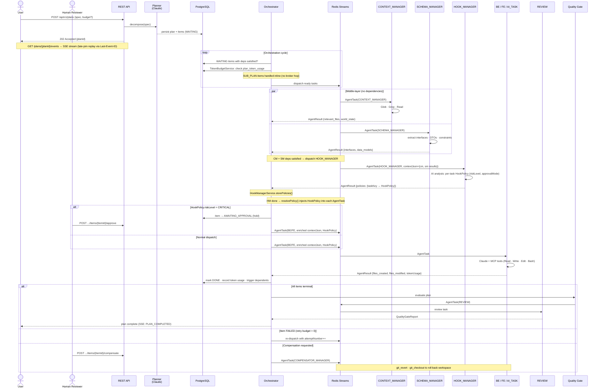

# Agent Framework

Multi-agent orchestration framework for AI-driven software delivery from natural language specifications.

## Status Snapshot

- Multi-stack worker profiles modeled explicitly (`be-java`, `be-go`, `be-rust`, `be-node`, `fe-react`).
- Worker modules generated compile-time from `agents/manifests/*.agent.yml` by `agent-compiler-maven-plugin`.
- Middle-layer worker types (`CONTEXT_MANAGER`, `SCHEMA_MANAGER`) run as plan dependencies before domain workers; they explore the codebase and extract schemas, delivering enriched context via `contextJson` to BE/FE/AI_TASK workers.
- Context-aware Read enforcement: domain workers may only Read files listed in the `CONTEXT_MANAGER` result (`relevant_files`); enforced at runtime by `PathOwnershipEnforcer.checkReadOwnership()`.
- Hook Manager worker (`HOOK_MANAGER`) sits between `SCHEMA_MANAGER` and domain workers in the pipeline (`CT→CM→SM→HM→BE/FE→RV`); it analyses each downstream task and produces a per-task `HookPolicy` more granular than the worker type alone.
- **Polyglot Header (SKILL.md)**: every worker has a single `.claude/agents/<name>/SKILL.md` file with YAML frontmatter (read by Claude Code CLI/IDE for subagent discovery) and a Markdown body (read by `SkillLoader.java` after stripping the frontmatter). Zero duality: one file, two runtimes.
- Dynamic `HookPolicy`: `HookManagerService` stores the HM worker output and injects the per-task policy into `AgentTask` at dispatch time; `HookPolicyResolver` provides a static fallback by `WorkerType` when HM has not yet run.
- Two built-in worker interceptors: `WorkerMetricsInterceptor` (MDC structured logging + `TASK_START`/`TASK_SUCCESS`/`TASK_FAILURE`, `HIGHEST_PRECEDENCE`) and `ResultSchemaValidationInterceptor` (JSON output validation, fail-open, `LOWEST_PRECEDENCE`).
- Tool access controlled by sealed `ToolAllowlist` interface (`All` | `Explicit`).
- Policy enforcement layer active at runtime: path ownership, context-aware read access, audit logging, tool filtering, tool usage tracking.
- Orchestrator routes by `workerType + workerProfile` using `WorkerProfileRegistry`.
- Messaging is pluggable (`redis` default, `jms`, `servicebus`).
- Structured execution provenance (`Provenance` record) attached to every `AgentResult`: token usage, tools used, prompt/skills hashes, trace correlation, timing.
- Dispatch metadata (`attemptNumber`, `dispatchAttemptId`, `traceId`, `dispatchedAt`) propagated from orchestrator to worker via `AgentTask`.
- REST API with 13+ endpoints: plan CRUD, quality gate, retry, dispatch attempts, snapshots, restore, SSE event streaming, resume, human approval, compensation.
- **Token Budget**: per-plan token ceiling via `PlanRequest.Budget` (onExceeded: `FAIL_FAST` | `NO_NEW_DISPATCH` | `SOFT_LIMIT`); PostgreSQL tracking via `plan_token_usage` table.
- **SSE Event Streaming**: `GET /api/v1/plans/{id}/events` — Server-Sent Events with late-join replay via `Last-Event-ID`; backed by append-only `PlanEvent` log (hybrid event sourcing).
- **Human Approval (AWAITING_APPROVAL)**: tasks with `riskLevel=CRITICAL` are held before dispatch; released via `POST .../items/{itemId}/approve` or failed via `POST .../items/{itemId}/reject`.
- **COMPENSATOR_MANAGER**: saga-based compensating transactions via dedicated worker; triggered via `POST .../items/{itemId}/compensate`.
- **SUB_PLAN**: orchestrator-inline hierarchical sub-plans; depth-guarded (default max-depth: 3); `awaitCompletion` flag controls fire-and-forget vs blocking dispatch.
- **agent-common module**: canonical `HookPolicy`, `ApprovalMode`, `RiskLevel` in `com.agentframework.common.policy` — single source of truth shared by orchestrator and worker-sdk.

## Architecture



1. `POST /api/v1/plans` creates a plan request (or `GET` to list, `GET /{planId}` to fetch).
2. Planner (Claude + structured output) decomposes into `PlanItem`s.
3. Orchestrator persists plan/items and dispatches tasks asynchronously, populating dispatch metadata (`attemptNumber`, `dispatchAttemptId`, `traceId`, `dispatchedAt`) on each `AgentTask`.
4. Dispatch target is resolved from profile registry:
   - `workerProfile` present -> profile topic/subscription.
   - `workerProfile` absent -> default profile for type, or fallback to `workerType.topicName()`.
5. Workers receive tasks via `WorkerTaskConsumer` and invoke `AbstractWorker.process()`.
6. `WorkerChatClientFactory` builds a `ChatClient` with two-layer tool pipeline:
   - **Allowlist filter** — removes unauthorized tools (LLM never sees them).
   - **Policy decorator** — wraps surviving tools with `PolicyEnforcingToolCallback` for path ownership checks, audit logging, and tool usage tracking.
7. Worker executes task context with Claude + MCP tools, captures `ChatResponse` metadata (token usage), and builds a `Provenance` record with execution details.
8. Worker publishes `AgentResult` (with embedded `Provenance`) back to orchestrator.
9. Orchestrator updates dependencies and triggers quality gate report when terminal.

## Repository Layout

| Path | Purpose |
|---|---|
| `agent-common/` | Shared library: `HookPolicy`, `ApprovalMode`, `RiskLevel` (`com.agentframework.common.policy`) |
| `agents/manifests/` | Source of truth for worker definitions (`*.agent.yml`) |
| `.claude/agents/*/SKILL.md` | Worker system prompts — polyglot header format (YAML frontmatter for Claude Code + Markdown body for Java runtime via `SkillLoader`) |
| `.claude/agents/` | 14 subagent definitions (Claude Code discovery): be, fe, contract, ai-task, context-manager, schema-manager, review, planner, be-go, be-node, be-rust, hook-manager, audit-manager, event-manager |
| `prompts/` | Prompt templates (`plan_tasks`, `quality_gate_report`, etc.) |
| `execution-plane/agent-compiler-maven-plugin/` | Manifest -> worker module generator |
| `execution-plane/worker-sdk/` | `AbstractWorker`, context builder, ChatClient factory, policy enforcement, provenance |
| `execution-plane/workers/` | Generated worker modules |
| `control-plane/orchestrator/` | REST API, planner, orchestration, state persistence |
| `config/worker-profiles.yml` | Profile registry (topic/subscription mapping) |
| `config/agent-registry.yml` | Generated worker metadata registry |
| `config/repo-layout.yml` | Path ownership rules per worker type |
| `messaging/` | Messaging SPI + providers (JMS/Redis/Service Bus) |
| `contracts/` | JSON Schemas, OpenAPI/AsyncAPI, event contracts |

## Active Worker Profiles

| Worker | Type | Profile | Topic | Subscription | Owns Paths |
|---|---|---|---|---|---|
| Backend Java | `BE` | `be-java` | `agent-tasks` | `be-java-worker-sub` | `backend/` |
| Backend Go | `BE` | `be-go` | `agent-tasks` | `be-go-worker-sub` | `backend/` |
| Backend Rust | `BE` | `be-rust` | `agent-tasks` | `be-rust-worker-sub` | `backend/` |
| Backend Node.js | `BE` | `be-node` | `agent-tasks` | `be-node-worker-sub` | `backend/` |
| Frontend React | `FE` | `fe-react` | `agent-tasks` | `fe-react-worker-sub` | `frontend/` |
| AI Task | `AI_TASK` | n/a | `agent-tasks` | `ai-task-worker-sub` | (none) |
| Contract | `CONTRACT` | n/a | `agent-tasks` | `contract-worker-sub` | `contracts/` |
| Review | `REVIEW` | n/a | `agent-reviews` | `review-worker-sub` | (none, read-only) |
| Context Manager | `CONTEXT_MANAGER` | n/a | `agent-tasks` | `context-manager-worker-sub` | (none, read-only) |
| Schema Manager | `SCHEMA_MANAGER` | n/a | `agent-tasks` | `schema-manager-worker-sub` | (none, read-only) |
| Hook Manager | `HOOK_MANAGER` | n/a | `agent-tasks` | `hook-manager-worker-sub` | (none, read-only) |
| Audit Manager | `AUDIT_MANAGER` | n/a | `agent-tasks` | `audit-manager-worker-sub` | `audit/` |
| Event Manager | `EVENT_MANAGER` | n/a | `agent-tasks` | `event-manager-worker-sub` | (none, read-only) |
| Task Manager | `TASK_MANAGER` | n/a | `agent-tasks` | `task-manager-worker-sub` | `issues/` |
| Compensator | `COMPENSATOR_MANAGER` | n/a | `agent-tasks` | `compensator-manager-worker-sub` | `.` |
| Sub-Plan | `SUB_PLAN` | — | — | — | — (handled inline by orchestrator) |

`CONTEXT_MANAGER` and `SCHEMA_MANAGER` workers have read-only access to the full repository (`readOnlyPaths: ["."]`). They use `Glob`, `Grep`, and `Read` to explore and produce structured context for downstream workers. Domain workers (BE/FE/AI_TASK) no longer have `Glob` or `Grep` in their allowlist — all file discovery is delegated to these managers.

`HOOK_MANAGER` runs after `SCHEMA_MANAGER` and before domain workers. It receives the CM and SM results as context and produces a `{"policies": {taskKey → HookPolicy}}` map that the orchestrator injects into subsequent `AgentTask` messages. `AUDIT_MANAGER` and `EVENT_MANAGER` are optional plan stages that respectively generate audit reports and react to hook violations.

All task workers share the unified `agent-tasks` topic. Azure Service Bus routes messages
to the correct worker subscription via SQL filter: multi-stack types (BE, FE) filter on
`workerProfile` property (e.g. `workerProfile = 'be-java'`), single-profile types (AI_TASK,
CONTRACT) filter on `workerType`. The orchestrator resolves default profiles automatically
when the planner doesn't assign one.

Defaults are configured in `config/worker-profiles.yml`:

- `BE -> be-java`
- `FE -> fe-react`

## Agent Manifest Format

Worker definitions live in `agents/manifests/*.agent.yml`. Example:

```yaml
apiVersion: agent-framework/v1
kind: AgentManifest

metadata:
  name: be-java-worker
  displayName: "Backend Java Worker (Spring Boot)"
  description: >
    Handles Java/Spring Boot backend tasks.

spec:
  workerType: BE
  workerProfile: be-java
  topic: agent-tasks
  subscription: be-java-worker-sub

  model:
    name: claude-sonnet-4-6
    maxTokens: 16384
    temperature: 0.2

  prompts:
    systemPromptFile: .claude/agents/be/SKILL.md
    skills:
      - skills/springboot-workflow-skills/
      - skills/crosscutting/
    instructions: |
      Implement the backend task using Java and Spring Boot.
    resultSchema: |
      { "files_created": [], "files_modified": [], "summary": "" }

  tools:
    dependencies:
      - io.github.massimilianopili:mcp-devops-tools
      - io.github.massimilianopili:mcp-filesystem-tools
      - io.github.massimilianopili:mcp-sql-tools
    allowlist:
      - Read
      - Write
      - Edit
      - Bash
    # Note: Glob and Grep are NOT listed — domain workers delegate file discovery
    # to CONTEXT_MANAGER and SCHEMA_MANAGER dependency tasks.

  ownership:
    ownsPaths:
      - backend/
    readOnlyPaths: []
    # readOnlyPaths is empty: contracts are delivered via SCHEMA_MANAGER contextJson.
    # Context-aware Read enforcement is applied at runtime by PathOwnershipEnforcer.

  concurrency:
    maxConcurrentCalls: 3
```

Key sections:

- `spec.tools.allowlist` — compile-time tool filtering via `ToolAllowlist.Explicit`; domain workers omit `Glob`/`Grep` (delegated to `CONTEXT_MANAGER`/`SCHEMA_MANAGER`)
- `spec.ownership.ownsPaths` — runtime write enforcement via `PolicyProperties`
- `spec.ownership.readOnlyPaths` — additional readable paths (empty for domain workers; `["."]` for `CONTEXT_MANAGER`)
- `spec.tools.dependencies` — Maven coordinates of MCP tool starters added to generated `pom.xml`

## Agent Compiler Plugin

The plugin lives in `execution-plane/agent-compiler-maven-plugin` and provides three goals:

| Goal | Phase | Description |
|---|---|---|
| `generate-workers` | `generate-sources` | Generates complete Maven modules from manifests |
| `validate-manifests` | `validate` | Validates manifest YAML without generating output |
| `generate-registry` | `generate-resources` | Generates `worker-profiles.yml` and `agent-registry.yml` |

### Typical Workflow

```bash
# Build/install the plugin artifact locally
mvn -pl execution-plane/agent-compiler-maven-plugin -am install -DskipTests

# Validate manifests (CI gate)
mvn com.agentframework:agent-compiler-maven-plugin:1.0.0-SNAPSHOT:validate-manifests

# Regenerate worker modules + registries
mvn com.agentframework:agent-compiler-maven-plugin:1.0.0-SNAPSHOT:generate-workers
mvn com.agentframework:agent-compiler-maven-plugin:1.0.0-SNAPSHOT:generate-registry
```

Generated artifacts per worker module:

- `src/main/java/.../XxxWorker.java` — `AbstractWorker` subclass with tool allowlist, skills, instructions
- `src/main/java/.../XxxWorkerApplication.java` — Spring Boot entry point
- `src/main/resources/application.yml` — Spring config with model, messaging, and policy settings
- `pom.xml` — Maven descriptor with tool dependencies
- `Dockerfile` — Container image build descriptor

## Policy Enforcement

The policy layer in `worker-sdk` enforces security policies at Java runtime, independent of Claude Code hooks. Active when `agent.worker.policy.enabled=true` (default).

### Components

| Class | Package | Purpose |
|---|---|---|
| `ToolAllowlist` | `worker` | Sealed interface: `All` (default) or `Explicit(List<String>)` |
| `PolicyProperties` | `worker.policy` | `@ConfigurationProperties` for `agent.worker.policy.*` |
| `PathOwnershipEnforcer` | `worker.policy` | Validates write-tool paths against `ownsPaths`; also enforces context-aware Read restriction (`checkReadOwnership()`) when `relevantFiles` is set |
| `ToolAuditLogger` | `worker.policy` | Structured logging via `audit.tools` logger with MDC |
| `PolicyEnforcingToolCallback` | `worker.policy` | Decorator wrapping each `ToolCallback` with ownership + audit + tool usage tracking |
| `PolicyAutoConfiguration` | `worker.policy` | Auto-config with `@ConditionalOnProperty` gate |
| `HashUtil` | `worker.util` | SHA-256 hashing for prompt/skills content fingerprinting |

### How It Works

```
ToolCallbackProvider[n] (from classpath: mcp-filesystem-tools, mcp-devops-tools, ...)
         |
         v
WorkerChatClientFactory.create(workerType, toolAllowlist)
  1. Allowlist filter  -->  ToolCallback[m]  (m <= n, unauthorized removed)
  2. Policy decorator  -->  PolicyEnforcingToolCallback[m]  (wrapped)
         |
         v
ChatClient with only authorized, policy-enforced tools
```

### Enforcement Behavior

- **Path ownership**: write tools (Write, Edit) targeting paths outside `ownsPaths` return `{"error":true,"message":"..."}` — the LLM can adapt.
- **Context-aware Read access**: when a `CONTEXT_MANAGER` result is present in `contextJson`, domain workers may only Read files listed in `relevant_files` (plus their own `ownsPaths`). Enforced via `PolicyEnforcingToolCallback` → `PathOwnershipEnforcer.checkReadOwnership()`. Fail-open: if the path cannot be extracted, the Read is allowed.
- **Audit logging**: every tool call logged to `audit.tools` logger with outcome (`SUCCESS`/`FAILURE`/`DENIED`), timing, and MDC context.
- **Tool usage tracking**: `PolicyEnforcingToolCallback` records tool names per-task via `ThreadLocal` — drained by `AbstractWorker` to populate `Provenance.toolsUsed`.
- **Fail-open**: if tool input cannot be parsed, the operation is allowed (filesystem `base-dir` remains the hard boundary).

### Task-Level HookPolicy (Dynamic)

When a `HOOK_MANAGER` task completes, `HookManagerService.storePolicies()` parses its
`{"policies": {taskKey → HookPolicy}}` output. At each subsequent dispatch,
`resolvePolicy()` looks up the per-task `HookPolicy` and injects it into the `AgentTask`
message. `PolicyEnforcingToolCallback` reads it from `TASK_POLICY` ThreadLocal (highest priority).

**Fallback chain**: `HookPolicy` (task-level, from HM worker) → `HookPolicyResolver` (per `WorkerType`, static) → `PolicyProperties` (application.yml).

`HookPolicy` fields (11 total — defined in `agent-common`, `com.agentframework.common.policy`):
- `allowedTools` — tool names this task may call (empty = inherit static config)
- `ownedPaths` — file path prefixes this task may write to (empty = inherit static config)
- `allowedMcpServers` — MCP server names allowed for this task
- `auditEnabled` — whether audit logging is required
- `maxTokenBudget` — per-task token ceiling; overrides plan-level budget (nullable)
- `allowedNetworkHosts` — outbound network hosts (e.g. `api.github.com`); empty = no restriction
- `requiredHumanApproval` — `ApprovalMode`: `NONE` (default) / `BLOCK` / `NOTIFY_TIMEOUT`
- `approvalTimeoutMinutes` — minutes to hold for approval when mode is `NOTIFY_TIMEOUT`
- `riskLevel` — `RiskLevel`: `LOW` / `MEDIUM` / `HIGH` / `CRITICAL` (CRITICAL → AWAITING_APPROVAL)
- `estimatedTokens` — estimated token consumption for pre-dispatch budget checks (nullable)
- `shouldSnapshot` — capture workspace snapshot before execution (rollback + audit)

### Defense-in-Depth

| Scenario | Shell Hooks (Tier 1) | Java Policy Layer | HookPolicy (Tier 2) |
|---|---|---|---|
| Dev: Claude Code | Active | Active | Active (if HM completed) |
| Dev: `mvn spring-boot:run` | Not active | **Active** | **Active** |
| Prod: Docker container | Not active | **Active** | **Active** |

Tier 1 = shell hooks in `.claude/settings.json` (planner-level, static, enforced by `enforce-tool-allowlist.sh`).
Tier 2 = `HookPolicy` record embedded in `AgentTask` (per-task, dynamic, from `HOOK_MANAGER` worker).

### Configuration (generated in `application.yml`)

```yaml
agent.worker.policy:
  enabled: true
  worker-profile: be-java
  owns-paths:
    - backend/
  write-tool-names:
    - Write
    - Edit
  audit:
    enabled: true
    include-input: false
    max-input-length: 200
```

Override at deploy time via env vars: `AGENT_WORKER_POLICY_OWNS_PATHS_0=backend/`.

## Messaging SPI

Transport-agnostic messaging with three provider implementations:

| Provider | Module | Activation |
|---|---|---|
| Redis Streams | `messaging/messaging-redis` | default (`messaging.provider=redis`) |
| JMS (Artemis) | `messaging/messaging-jms` | `spring.profiles.active=jms` |
| Azure Service Bus | `messaging/messaging-servicebus` | `spring.profiles.active=servicebus` |

Core abstractions in `messaging/messaging-api`:

- `MessageEnvelope` — transport-agnostic message carrier (messageId, destination, body, properties)
- `MessageSender` — send interface
- `MessageListenerContainer` — subscription lifecycle (subscribe, start, stop)
- `MessageHandler` — callback functional interface

## Advanced Features

### SSE Event Streaming

`GET /api/v1/plans/{planId}/events` returns a Server-Sent Event stream. Each event corresponds
to a state transition recorded in the append-only `PlanEvent` log.

**Late-join replay**: clients that reconnect (or join after plan start) pass the `Last-Event-ID`
header with the last received `sequenceNumber`. The `SseEmitterRegistry` replays all `PlanEvent`
records with a higher sequence number before attaching the live stream. This means no events are
missed across reconnects.

```bash
curl -N http://localhost:8080/api/v1/plans/{planId}/events
# Or resume from event #5:
curl -N -H "Last-Event-ID: 5" http://localhost:8080/api/v1/plans/{planId}/events
```

Event types: `PLAN_STARTED`, `PLAN_PAUSED`, `PLAN_RESUMED`, `TASK_DISPATCHED`,
`TASK_COMPLETED`, `TASK_FAILED`, `PLAN_COMPLETED`.

### Token Budget

Attach a budget to any plan to cap total token consumption:

```json
{
  "spec": "Build a REST API",
  "budget": {
    "maxTotalTokens": 100000,
    "onExceeded": "FAIL_FAST",
    "perWorkerType": { "BE": 40000, "FE": 20000 }
  }
}
```

`onExceeded` values:
- `FAIL_FAST` — transition plan to FAILED immediately on budget breach.
- `NO_NEW_DISPATCH` — stop dispatching new items; let in-flight items complete.
- `SOFT_LIMIT` — log warning only; continue execution.

Token consumption is tracked in `plan_token_usage` (PostgreSQL). Each `AgentResult` carries
`Provenance.tokenUsage`; `TokenBudgetService` aggregates and enforces per-plan and per-worker-type
limits before each dispatch.

### Human Approval (AWAITING_APPROVAL)

When the `HOOK_MANAGER` assigns `riskLevel=CRITICAL` or `requiredHumanApproval=BLOCK` to a task,
the orchestrator transitions that `PlanItem` to `AWAITING_APPROVAL` instead of dispatching it.
The plan continues executing other independent items while the high-risk item waits.

**Approve** (releases item to WAITING → dispatch):
```bash
POST /api/v1/plans/{planId}/items/{itemId}/approve
```

**Reject** (marks item FAILED):
```bash
POST /api/v1/plans/{planId}/items/{itemId}/reject
{"reason": "Deployment to prod not authorized yet"}
```

`requiredHumanApproval=NOTIFY_TIMEOUT` auto-fails the item after `approvalTimeoutMinutes` if
no human acts.

### COMPENSATOR_MANAGER

The `COMPENSATOR_MANAGER` worker performs saga-style compensating transactions to undo the
effects of a failed or unwanted task. It uses git-based MCP tools (`git_revert`, `git_stash`,
`git_checkout`) to roll back file changes captured in a workspace snapshot.

Trigger compensation for any terminal item:
```bash
POST /api/v1/plans/{planId}/items/{itemId}/compensate
{"reason": "Rolling back BE-003 due to security review failure"}
```

The orchestrator creates a new `PlanItem` of type `COMPENSATOR_MANAGER`, which the dedicated
worker picks up. If `shouldSnapshot=true` was set in `HookPolicy`, a snapshot was captured before
execution and the compensator can restore it.

### SUB_PLAN (Hierarchical Plans)

A `PlanItem` of type `SUB_PLAN` is handled inline by the orchestrator — no message broker hop.
When the item is ready for dispatch, `OrchestrationService.handleSubPlan()`:
1. Validates depth (`plan.depth < maxDepth`; default: 3 levels).
2. Calls `PlannerService.decompose(subPlanSpec)` to create a child `Plan`.
3. Stores `childPlanId` on the parent item.
4. If `awaitCompletion=true`: transitions item to `DISPATCHED` and waits for the
   `PlanCompletedEvent`; marks item DONE/FAILED when child terminates.
5. If `awaitCompletion=false`: marks item DONE immediately (fire-and-forget).

The `@EventListener onChildPlanCompleted()` in `OrchestrationService` handles the async
notification when a child plan reaches a terminal state.

### agent-common Module

`agent-common` is a pure-Java library (no Spring) that holds the types shared between the
orchestrator (control-plane) and worker-sdk (execution-plane):

| Type | Package | Description |
|------|---------|-------------|
| `HookPolicy` | `com.agentframework.common.policy` | 11-field record: policy for a single task |
| `ApprovalMode` | `com.agentframework.common.policy` | `NONE` / `BLOCK` / `NOTIFY_TIMEOUT` |
| `RiskLevel` | `com.agentframework.common.policy` | `LOW` / `MEDIUM` / `HIGH` / `CRITICAL` |

The old definitions in `com.agentframework.orchestrator.hooks` and
`com.agentframework.worker.policy` are `@Deprecated` stubs kept for source compatibility;
they will be removed in a future release.

## Local Development

### Prerequisites

- Java 17
- Maven 3.9+
- Docker (for Postgres + Redis in dev)
- `ANTHROPIC_API_KEY`

### Start Dependencies

```bash
# Local development (Redis Streams DB 3 + PostgreSQL)
docker compose -f docker/docker-compose.dev.yml up -d postgres redis

# SOL server (uses shared Redis + shared Docker network)
docker compose -f docker/docker-compose.sol.yml --env-file docker/sol.env up -d
```

### Run Orchestrator

```bash
cd control-plane/orchestrator
mvn spring-boot:run -Dspring-boot.run.profiles=dev
```

### Submit a Plan

```bash
curl -X POST http://localhost:8080/api/v1/plans \
  -H "Content-Type: application/json" \
  -d '{"spec":"Build a REST API for user management"}'
```

### API Endpoints

| Method | Path | Description |
|---|---|---|
| `POST` | `/api/v1/plans` | Create and start a new plan |
| `GET` | `/api/v1/plans/{planId}` | Get plan status and items |
| `GET` | `/api/v1/plans/{planId}/quality-gate` | Get quality gate report |
| `POST` | `/api/v1/plans/{planId}/resume` | Resume a PAUSED plan |
| `GET`  | `/api/v1/plans/{planId}/events` | SSE stream of plan events (late-join replay via `Last-Event-ID`) |
| `GET`  | `/api/v1/plans/{planId}/graph` | Visual DAG (`?format=mermaid\|json`) |
| `POST` | `/api/v1/plans/{planId}/items/{itemId}/retry` | Retry a failed plan item |
| `POST` | `/api/v1/plans/{planId}/items/{itemId}/approve` | Approve AWAITING_APPROVAL item (→ WAITING) |
| `POST` | `/api/v1/plans/{planId}/items/{itemId}/reject` | Reject AWAITING_APPROVAL item (→ FAILED) |
| `POST` | `/api/v1/plans/{planId}/items/{itemId}/compensate` | Start compensating transaction via COMPENSATOR_MANAGER |
| `GET` | `/api/v1/plans/{planId}/items/{itemId}/attempts` | List dispatch attempts for an item |
| `GET` | `/api/v1/plans/{planId}/snapshots` | List plan snapshots |
| `POST` | `/api/v1/plans/{planId}/restore/{snapshotId}` | Restore plan from snapshot |
| `POST` | `/audit/events` | Receive audit event from `audit-log.sh` (AuditManagerService) |
| `GET`  | `/audit/events?taskKey=` | Query stored audit events |
| `POST` | `/events/violation` | Receive hook violation event from shell script (EventManagerService) |
| `GET`  | `/events/violations?taskKey=` | Query violations per task |
| `GET`  | `/events/health` | Violation count summary |

Attempts and snapshots endpoints return DTOs (`DispatchAttemptResponse`, `PlanSnapshotResponse`), not JPA entities.

## Prompt and Skill Resource Loading

### Orchestrator prompts

`PromptLoader` loads from classpath paths:

- `prompts/planner.agent.md`
- `prompts/review.agent.md`
- `prompts/plan_tasks.prompt.md`
- `prompts/quality_gate_report.prompt.md`

### Worker system prompts / skills

`SkillLoader` resolution order:

1. `${FS_SKILLS_DIR}/<resourcePath>` (filesystem override — default in production; set to repository root)
2. classpath fallback (files packaged in the worker JAR)

**Frontmatter stripping**: if a file starts with `---`, `SkillLoader.stripFrontmatter()` automatically removes the YAML frontmatter block before passing the content to the LLM. This allows `.claude/agents/*/SKILL.md` files to contain both the Claude Code configuration (frontmatter) and the Java LLM system prompt (body) in a single file.

Worker manifests reference prompts as `.claude/agents/<name>/SKILL.md`. Ensure `FS_SKILLS_DIR` points to the repository root (e.g., `FS_SKILLS_DIR=/workspace/agent-framework`) so `SkillLoader` resolves `.claude/agents/be/SKILL.md` as `$FS_SKILLS_DIR/.claude/agents/be/SKILL.md`.

## Claude Code Subagents — Polyglot Header

Every worker type has a subagent definition in `.claude/agents/<name>/SKILL.md`.
The same file serves as both a **Claude Code subagent** and a **Java LLM system prompt**:

```
.claude/agents/<name>/SKILL.md
        │
        ├── YAML Frontmatter  (--- ... ---)
        │         └── Read by: Claude Code CLI / IDE  (subagent discovery)
        │               fields: name, description, tools, model, permissionMode, hooks
        │
        └── Markdown Body
                  └── Read by: Java runtime via SkillLoader
                        (stripFrontmatter() removes the frontmatter, passes the body to the LLM)
```

### Worker categories

| Category | Workers | `permissionMode` | Hooks |
|----------|---------|-----------------|-------|
| **Write-capable** | `be`, `fe`, `contract`, `ai-task`, `be-go`, `be-node`, `be-rust` | — | `enforce-ownership.sh` on `Edit\|Write`; `enforce-mcp-allowlist.sh` on `mcp__.*` |
| **Read-only** | `context-manager`, `schema-manager`, `review`, `planner`, `hook-manager`, `event-manager` | `plan` | none (plan mode blocks all writes) |
| **Audit-write** | `audit-manager` | — | `enforce-ownership.sh` (writes only to `audit/`) |

### Hook pattern for write-capable workers

```yaml
hooks:
  PreToolUse:
    - matcher: "Edit|Write"
      hooks:
        - type: command
          command: "AGENT_WORKER_TYPE=BE $CLAUDE_PROJECT_DIR/.claude/hooks/enforce-ownership.sh"
    - matcher: "mcp__.*"
      hooks:
        - type: command
          command: "AGENT_WORKER_TYPE=BE $CLAUDE_PROJECT_DIR/.claude/hooks/enforce-mcp-allowlist.sh"
```

`enforce-ownership.sh` reads `config/generated/hooks-config.json` to determine allowed paths for each `AGENT_WORKER_TYPE`. If the variable is unset, the script exits 0 (dev mode — allows all).

### Adding a new worker

1. Create `.claude/agents/<name>/SKILL.md` with YAML frontmatter + Markdown system prompt.
2. Create `agents/manifests/<name>.agent.yml` with `systemPromptFile: .claude/agents/<name>/SKILL.md`.
3. Add the new `workerType` entry to `config/generated/hooks-config.json`.
4. Run `mvn generate-workers` to generate the Java worker module.

---

## Known Gaps

- `Provenance.model` field is populated as `null` — requires extracting model identifier from `ChatResponse` metadata (Spring AI does not expose it uniformly across providers yet).

## Tech Stack

- Java 17
- Spring Boot 3.4.1
- Spring AI 1.0.0 (Anthropic)
- Azure Service Bus / Redis Streams / JMS Artemis
- Maven plugin code generation (Mustache + SnakeYAML)
- Custom MCP tools (`mcp-filesystem-tools`, `mcp-devops-tools`, `mcp-sql-tools`)

## Documentation

| Documento | Descrizione |
|-----------|-------------|
| [Setup Guide](SETUP.md) | Installazione, configurazione, primo avvio |
| [Manuale Utente](docs/manual/user-guide.md) | Guida completa: quick-start, architettura, API, deploy, troubleshooting |
| [Orchestrator](control-plane/orchestrator/README.md) | REST API, domain model, state machine, configurazione |
| [Worker SDK](execution-plane/worker-sdk/README.md) | AbstractWorker API, interceptor, policy enforcement |
| [Compiler Plugin](execution-plane/agent-compiler-maven-plugin/README.md) | 3 goal Maven, manifest schema, output generato |
| [Messaging](messaging/README.md) | SPI, provider JMS/Redis/Service Bus |
| [Contracts](contracts/README.md) | JSON Schema, OpenAPI, AsyncAPI, topologia eventi |
| [MCP & Tools](mcp/README.md) | Server MCP, allowlist, sandbox, redaction |
| [Configuration](config/README.md) | File YAML: profili, quality gate, policy, ambienti |
| [Generated Workers](execution-plane/workers/README.md) | Struttura moduli generati, esecuzione locale |

### Architecture Decision Records

| ADR | Decisione |
|-----|-----------|
| [ADR-001](docs/adr/ADR-001-service-bus-topology.md) | Topologia Service Bus: topic unificato + per-profile subscription |
| [ADR-002](docs/adr/ADR-002-structured-output.md) | Gestione structured output dal modello |
| [ADR-003](docs/adr/ADR-003-legacy-deprecation-roadmap.md) | Roadmap deprecazione naming legacy |

### Other Docs

| Documento | Descrizione |
|-----------|-------------|
| [Architecture Overview](docs/architecture/overview.md) | Diagrammi architetturali |
| [Branching Flow](docs/branching/flow-vertical-horizontal.md) | Strategia branching vertical-horizontal |

## License

Apache License 2.0
