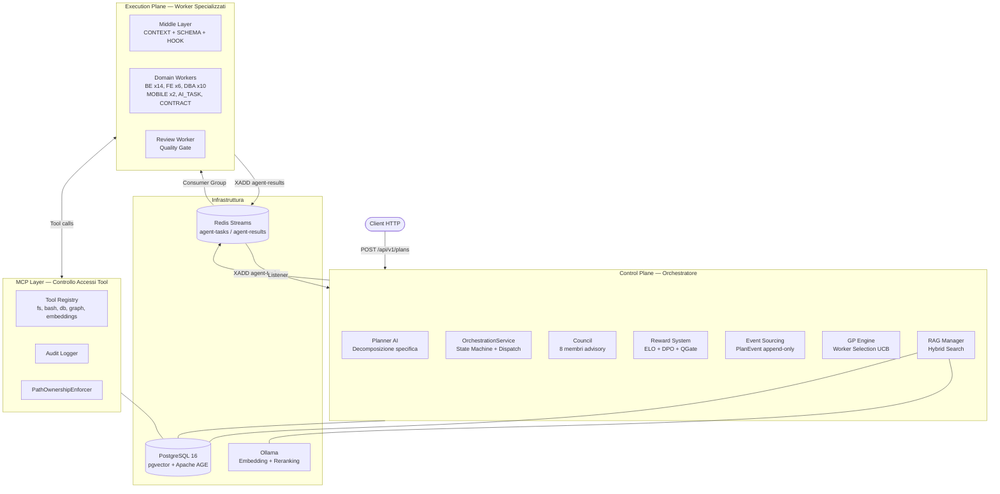
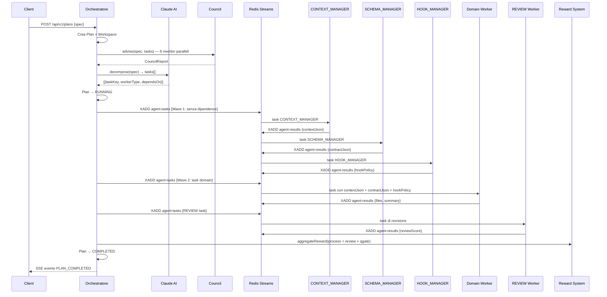
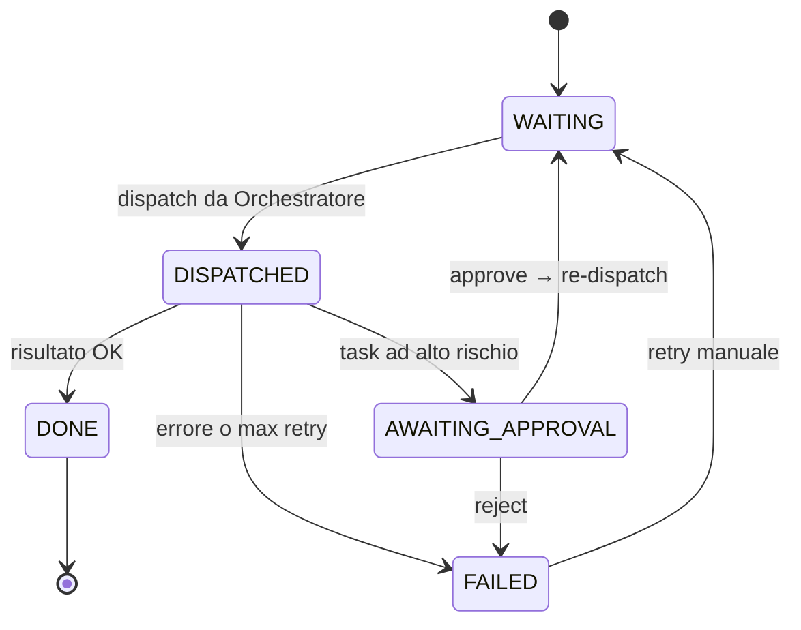
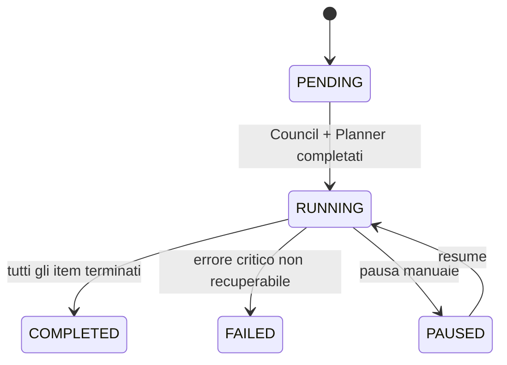
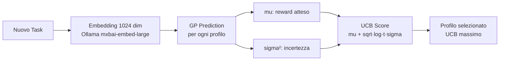
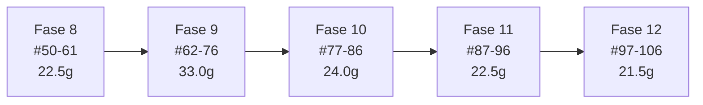

# Agent Framework — Flusso Architetturale Dettagliato

> **Versione**: 1.1.0-SNAPSHOT · **Aggiornato**: 2026-03-08
> **Stack**: Java 21, Spring Boot 3.4.1, Spring AI 1.0.0, Redis Streams, PostgreSQL 16 + pgvector + Apache AGE

---

## Cos'è l'Agent Framework

L'Agent Framework è un **orchestratore multi-agente** per la generazione di codice AI-driven. Prende in input una specifica in linguaggio naturale (es. *"Crea una REST API per la gestione utenti con autenticazione JWT"*) e produce in output il codice sorgente completo, testato e revisionato — attraverso un pipeline di agenti specializzati che collaborano in modo orchestrato.

Il framework non è un chatbot: è un **sistema distribuito autonomo** con state machine formali, messaggistica asincrona, controllo degli accessi granulare, feedback loops e un meccanismo di apprendimento continuo basato su reward e rating ELO.

---

## Architettura a tre piani

Il sistema è diviso in tre piani logici separati, ciascuno con responsabilità distinte e ben definite:



| Piano | Responsabilità | Tecnologia |
|-------|---------------|-----------|
| **Control Plane** | Creazione piano, decomposizione AI, dispatch, state machine, reward, event sourcing | Spring Boot, Spring AI, PostgreSQL, Flyway |
| **Execution Plane** | Implementazione task, esplorazione codebase, estrazione contratti, quality gate | Worker containers, Spring AI, MCP tools |
| **MCP Layer** | Accesso agli strumenti (file system, shell, DB, graph), access control, audit | Tool registry con deny-all + allowlist |

---

## Il flusso completo — 14 step

Di seguito è descritto ogni passaggio che avviene dall'invio della specifica al completamento del piano.



---

### Step 1 — Ricezione della specifica

**Chi**: `PlanController.createPlan()`
**Endpoint**: `POST /api/v1/plans`
**Input**:
```json
{
  "spec": "Create a REST API for user management with JWT authentication",
  "projectPath": "/workspace/my-project",
  "modelId": null
}
```

**Perché**: Il punto di ingresso unico del sistema. La specifica è in linguaggio naturale — il framework si occupa di tutto il resto. L'utente non deve conoscere i worker, i topic Redis o le dipendenze tra task.

**Output**: `202 Accepted` con `planId` e `status: RUNNING`. Il piano è asincrono: il client riceve subito il `planId` e poi segue il progresso via SSE.

---

### Step 2 — Creazione Piano e Workspace

**Chi**: `PlanService.create()` + `WorkspaceManager.createWorkspace()`
**Perché del workspace**: ogni piano lavora in un file system isolato (`/workspace/{planId}/`). Questo impedisce che worker paralleli di piani diversi si sovrascrivano i file a vicenda. È la stessa logica dei "worktree" git — isolamento senza duplicazione dell'intero repository.

**Stato iniziale**: `Plan(PENDING)` → transisce a `RUNNING` dopo il Council e il Planner.

**Event sourcing**: viene emesso subito il primo `PlanEvent(PLAN_STARTED)` nel log append-only.

---

### Step 3 — Council Pre-Planning (Advisory)

**Chi**: `CouncilService.advise(spec, tasks)`
**Composizione**: 8 membri dinamici — 4 manager fissi + 4 specialist scelti in base al dominio della specifica

| Ruolo | Tipo | Contributo |
|-------|------|-----------|
| `orchestration-expert` | Manager | Analizza le dipendenze tra task, suggerisce l'ordine di esecuzione |
| `security-expert` | Manager | Identifica rischi di sicurezza nella specifica |
| `performance-expert` | Manager | Anticipa bottleneck e pattern da evitare |
| `testing-expert` | Manager | Raccomanda strategia di test e coverage minima |
| `api-design-specialist` | Specialist (se REST API) | Raccomanda naming, versioning, idempotency |
| `db-design-specialist` | Specialist (se DB presente) | Schema, indici, relazioni |
| ... | Specialist (dipende dal dominio) | |

**Perché**: Senza il Council, gli errori architetturali vengono scoperti solo quando il codice è già scritto — costa molto di più correggerli. Il Council è un **investimento preventivo**: costa qualche secondo in più all'inizio, ma evita retry costosi in termini di token e tempo.

**Output**: `CouncilReport` con `consensusScore`, `recommendations[]` prioritizzate e `riskAssessment`.

**Nota**: I membri del Council sono anch'essi worker AI (Claude), ma vengono chiamati in **parallelo** e producono raccomandazioni, non codice.

---

### Step 4 — Decomposizione AI del Piano

**Chi**: `PlannerService.decompose(spec)`
**Come**: chiamata a Claude AI con il prompt `prompts/plan_tasks.prompt.md`, arricchito dal `CouncilReport`.

**Output del Planner**:
```json
[
  {"taskKey": "contract-user-api",  "workerType": "CONTRACT", "dependsOn": []},
  {"taskKey": "be-user-service",    "workerType": "BE",       "workerProfile": "be-java", "dependsOn": ["contract-user-api"]},
  {"taskKey": "fe-user-dashboard",  "workerType": "FE",       "workerProfile": "fe-react","dependsOn": ["contract-user-api"]},
  {"taskKey": "dba-user-schema",    "workerType": "DBA",      "workerProfile": "dba-postgres","dependsOn": []},
  {"taskKey": "review-final",       "workerType": "REVIEW",   "dependsOn": ["be-user-service", "fe-user-dashboard"]}
]
```

**Perché** il Planner usa le dipendenze (`dependsOn`): permette di eseguire task **indipendenti in parallelo** (es. BE e FE partono insieme dopo il Contract) e task dipendenti **in sequenza**. Il DAG risultante è visualizzabile con `GET /api/v1/plans/{id}/graph?format=mermaid`.

**Flyway V1-V9**: ogni versione aggiunge tabelle. La V9 è la più recente (`dpo_gp_residual`). Le migrazioni sono idempotenti e vengono eseguite all'avvio dell'Orchestratore.

---

### Step 5 — Dispatch Wave 1

**Chi**: `OrchestrationService.dispatchWave()`
**Logica**: vengono selezionati i `PlanItem` con `dependsOn` vuoto (o tutte le dipendenze già in stato `DONE`).

**Perché il dispatch a ondate (waves)**: invece di accodare tutti i task subito, il sistema aspetta che le dipendenze siano soddisfatte. Questo crea un **flusso controllato**: la Wave 1 contiene solo i task radice del DAG, la Wave 2 contiene i task che dipendono dalla Wave 1, ecc.

**Messaggio pubblicato su Redis Streams**:
```json
{
  "id": "uuid-123",
  "planId": "PLAN-42",
  "taskKey": "contract-user-api",
  "workerType": "CONTRACT",
  "spec": "Define OpenAPI 3.1 spec for user management endpoints",
  "metadata": {
    "correlationId": "PLAN-42",
    "attempt": 1,
    "maxRetries": 3,
    "tokenBudget": 50000
  }
}
```

**Transizione di stato**: `PlanItem: WAITING → DISPATCHED`.

---

### Step 6 — CONTEXT_MANAGER (Esplorazione Codebase)

**Perché esiste**: i worker domain (BE, FE, DBA) devono capire *dove* intervenire nel codebase esistente — quali file sono già presenti, quali pattern sono già stati usati, quali dipendenze sono dichiarate. Senza questo contesto, ogni worker ricomincerebbe da zero o farebbe scelte inconsistenti con il resto del progetto.

**Cosa fa**:
1. Esplora il workspace con `fs_list` e `fs_read`
2. Identifica i file rilevanti per il task (non tutti — solo quelli pertinenti)
3. Costruisce il **world state**: risultati dei task completati in parallelo
4. Estrae i vincoli architetturali (es. "usa sempre Spring Boot, non Quarkus")

**Output** (`contextJson`):
```json
{
  "relevant_files": [
    "backend/pom.xml",
    "backend/src/main/java/com/example/config/SecurityConfig.java"
  ],
  "world_state": {
    "parallel_completed": ["dba-user-schema"],
    "shared_data": {
      "db_schema": "CREATE TABLE users (id UUID PRIMARY KEY, email VARCHAR...)"
    }
  },
  "constraints": ["Spring Boot 3.4.1", "PostgreSQL 16", "JWT RS256"]
}
```

**PathOwnershipEnforcer**: solo i file in `relevant_files` sono leggibili dai worker domain. Gli altri sono negati a livello MCP — un worker BE non può per sbaglio leggere file di configurazione di produzione non rilevanti.

---

### Step 7 — SCHEMA_MANAGER (Estrazione Contratti)

**Perché esiste**: nel pattern **Contract-First**, il contratto OpenAPI è la fonte di verità condivisa tra BE e FE. Senza un'estrazione centralizzata, ogni worker interpreterebbe il contratto in modo diverso — generando inconsistenze tra client TypeScript e server Spring Boot.

**Cosa fa**:
1. Legge le specifiche OpenAPI dal workspace (generate dal CONTRACT worker)
2. Normalizza gli endpoint, i DTO, i codici di risposta
3. Valida lo schema con Spectral (linting) e oasdiff (breaking change detection)

**Output** (`contractJson`):
```json
{
  "endpoints": [
    {
      "method": "GET",
      "path": "/api/v1/users",
      "operationId": "listUsers",
      "responses": {"200": {"schema": "UserListResponse"}}
    }
  ],
  "dtos": {"UserListResponse": {"type": "object", "properties": {...}}}
}
```

**Separazione delle responsabilità**: il worker BE riceve il contratto già estratto e normalizzato — non deve ri-parsare l'OpenAPI spec. Questo riduce il numero di token consumati e il rischio di interpretazioni divergenti.

---

### Step 8 — HOOK_MANAGER (Policy per Task)

**Perché esiste**: il modello di accesso agli strumenti è **deny-all per default**. Ogni worker può usare solo i tool esplicitamente autorizzati per quel task. Ma l'allowlist statica (per tipo di worker) è troppo grossolana — un task di "scrittura test" non dovrebbe poter modificare i file di produzione. L'HOOK_MANAGER genera policy **per-task**, più granulari.

**Come funziona**:
1. Analizza il piano completo e il `contextJson`
2. Per ogni task, genera una `HookPolicy` personalizzata

**Output** (`hookPolicy`):
```json
{
  "allowedTools": ["fs_list", "fs_read", "fs_write", "bash_execute"],
  "ownedPaths": ["backend/src/", "backend/test/"],
  "allowedMcpServers": ["repo-fs", "bash"],
  "riskLevel": "MEDIUM",
  "maxTokenBudget": 45000
}
```

**Fallback**: se l'HOOK_MANAGER non è disponibile, `HookPolicyResolver.byWorkerType()` applica la policy statica del tipo di worker — il sistema degrada gracefully senza bloccarsi.

---

### Step 9 — Domain Workers (Implementazione)

**Chi**: uno dei ~41 worker specializzati, selezionato dalla `GpWorkerSelectionService`

**Categorie di worker**:

| Tipo | Profili disponibili | Cosa produce |
|------|---------------------|-------------|
| **BE** | java, go, rust, node, python, kotlin, quarkus, laravel, cpp, lua, dotnet, elixir, ocaml | Servizi, controller, repository, test |
| **FE** | react, nextjs, vue, angular, svelte, vanillajs | Componenti UI, state management, API client |
| **DBA** | postgres, mysql, oracle, mssql, sqlite, mongo, graphdb, vectordb, redis, cassandra | Schema, migrazioni, query ottimizzate |
| **MOBILE** | swift, kotlin | App iOS/Android |
| **AI_TASK** | (generico) | Documentazione, test e2e, task trasversali |
| **CONTRACT** | (generico) | OpenAPI 3.1, Spectral linting, oasdiff |
| **REVIEW** | (generico) | Quality gate, sicurezza, compliance architetturale |

**Come viene scelto il profilo**: il **Gaussian Process Engine** (Step 8.5 implicito) predice il profilo con reward atteso più alto per questo task, basandosi sulle performance storiche (`task_outcomes` tabella con embedding 1024 dim e rating ELO).

**Cosa riceve il worker** (messaggio completo):
```json
{
  "taskKey": "be-user-service",
  "spec": "...",
  "contextJson": {...},
  "contractJson": {...},
  "hookPolicy": {...},
  "skillPaths": ["skills/springboot-workflow-skills/", "skills/crosscutting/"]
}
```

**Cosa fa il worker**:
1. Carica i documenti di skill (`SkillLoader`)
2. Invoca Claude AI con prompt dedicato + skill docs
3. Claude usa i MCP tools (fs_write, bash_execute, ecc.) per scrivere i file
4. Ogni tool call passa per il `PathOwnershipEnforcer` e l'`AuditLogger`

**Risultato** (pubblicato su `agent-results`):
```json
{
  "taskKey": "be-user-service",
  "status": "DONE",
  "resultJson": {
    "files_created": ["backend/src/main/java/.../UserService.java"],
    "summary": "Created UserService with CRUD and JWT interceptor"
  },
  "tokenUsage": {"inputTokens": 2500, "outputTokens": 3200},
  "metrics": {"durationMs": 15000, "toolCalls": 23}
}
```

---

### Step 10 — Raccolta Risultati e State Machine

**Chi**: `OrchestrationService.onTaskCompleted()` (listener su `agent-results`)

**Transizioni di stato**:



**Idempotency guard**: se lo stesso `taskKey` arriva due volte (edge case da crash + replay), il secondo messaggio viene scartato. L'ACK su Redis Streams avviene solo dopo il commit della transazione DB — se il commit fallisce, Redis ri-consegna il messaggio.

**Token budget**: `TokenBudgetService` aggiorna il contatore per worker type. Se si supera la soglia, si applica la policy configurata: `FAIL_FAST` (fallisce subito), `NO_NEW_DISPATCH` (non accoda nuovi task), o `SOFT_LIMIT` (log warning, continua).

---

### Step 11 — Dispatch Wave Successiva

**Chi**: `OrchestrationService.dispatchNextWave()`
**Logica**: dopo ogni `DONE`, viene ricalcolato il set di item pronti (tutte le dipendenze soddisfatte).

**Parallelismo**: item indipendenti vengono accodati **tutti insieme** nella stessa wave. Il sistema supporta centinaia di worker in parallelo — il limite è la banda del cluster Redis, non l'architettura.

**Missing context**: se un domain worker segnala che non aveva abbastanza contesto, l'Orchestratore crea automaticamente un nuovo task `CONTEXT_MANAGER` mirato, poi ri-accoda il task originale. Questo **feedback loop** evita di dover configurare manualmente il contesto a priori.

---

### Step 12 — REVIEW Worker (Quality Gate)

**Chi**: `review-worker`
**Perché**: un domain worker (BE, FE) è ottimizzato per *produrre* codice velocemente. Un worker di review è ottimizzato per *criticare* quel codice — usare lo stesso agente per entrambi produce conflitti cognitivi nel modello AI.

**Cosa controlla**:
- Conformità ai pattern architetturali documentati
- Copertura test (unit + integration)
- Vulnerabilità di sicurezza (OWASP Top 10)
- Breaking change vs. contratto OpenAPI (oasdiff)
- Convenzioni di naming e stile

**Ralph-Loop**: se `sigma²` del GP supera una soglia (alta incertezza sul worker scelto), il REVIEW viene eseguito *prima* del domain worker. Il feedback viene iniettato nel task del domain worker, che può così migliorare il proprio output prima della consegna finale.

**Output** (`reviewScore`): valore `[-1.0, +1.0]` con commenti specifici per punto.

---

### Step 13 — Reward Aggregation e ELO

**Perché il reward system**: il framework impara dai propri errori. Ogni task completato alimenta un sistema di rating che, nel tempo, migliora la selezione dei worker e la qualità degli output.

**Tre fonti di reward**:

| Fonte | Range | Disponibilità | Descrizione |
|-------|-------|---------------|-------------|
| **Review Score** | [-1.0, +1.0] | Solo se REVIEW eseguito | Valutazione qualitativa del codice prodotto |
| **Process Score** | [0.0, +1.0] | Sempre (deterministico) | `1 - (tokenCost·w₁ + retryCost·w₂ + durationCost·w₃)` |
| **Quality Gate Score** | [0.0, +1.0] | Post-completamento piano | Compliance architetturale, test coverage, sicurezza |

**Aggregazione Bayesiana**:
```
AggregatedReward = w_review · ReviewScore
                 + w_process · ProcessScore
                 + w_qgate · QualityGateScore
```
I pesi vengono aggiornati tramite *Bayesian belief updating* in base alla confidenza di ciascuna fonte.

**ELO Rating System** (per profilo worker):
```
ELO_new = ELO_old + 32 · (AggregatedReward - ExpectedReward)
ExpectedReward = 1 / (1 + 10^((Rating_Avversario - Rating_Self) / 400))
```

**Leaderboard**: `GET /api/v1/rewards/stats` restituisce il ranking per profilo worker con ELO, numero tentativi e win rate.

**DPO (Direct Preference Optimization)**: ogni confronto tra due worker produce una *preference pair* (`preferred_task_key`, `rejected_task_key`) che può essere usata per fine-tuning futuro del modello.

---

### Step 14 — Completamento Piano

**Chi**: `OrchestrationService.checkPlanCompletion()`
**Condizione**: tutti i `PlanItem` in stato `DONE` o `FAILED` (nessuno in `WAITING`, `DISPATCHED`, `AWAITING_APPROVAL`).

**Transizione finale**:


**Quality Gate finale**: `QualityGateService.evaluate(plan)` esegue l'analisi complessiva del piano e produce il `QualityGateScore`.

**SSE evento**: il client riceve `PlanEvent(PLAN_COMPLETED, sequenceNumber=N)` sullo stream `/api/v1/plans/{id}/events`.

---

## Componenti Trasversali

### Messaging: Redis Streams

**Perché asincrono** (e non HTTP sincrono): i worker possono impiegare secondi o minuti per completare un task. Una chiamata HTTP sincrona bloccherebbe l'Orchestratore per tutto quel tempo, impedendogli di gestire altri piani. Con Redis Streams:
- L'Orchestratore pubblica e torna disponibile immediatamente
- I worker consumano al proprio ritmo
- Se un worker si riavvia, i messaggi non ACKati vengono ri-consegnati (PEL — Pending Entries List)
- Il back-pressure è gestito automaticamente dalla lunghezza dello stream

**Topic `agent-tasks`** (Orchestratore → Worker):
```
XADD agent-tasks * id uuid planId PLAN-42 taskKey be-user-service ...
```

**Topic `agent-results`** (Worker → Orchestratore):
```
XADD agent-results * taskKey be-user-service status DONE resultJson {...}
```

**Consumer groups**: ogni tipo di worker ha il proprio consumer group. Un messaggio per `workerType=BE` viene consumato solo dal pool di worker BE — gli altri lo ignorano grazie al filtering client-side in `WorkerTaskConsumer.shouldProcess()`.

**Alternativa Azure Service Bus**: disponibile come profilo Spring (`--spring.profiles.active=azure-service-bus`). Usa Topic + Subscription con SQL filter (`workerType = 'BE'`) e DLQ (Dead Letter Queue) per messaggi non processabili dopo 10 tentativi. La session support (`sessionId = planId`) garantisce il FIFO ordering per-piano.

---

### MCP Layer e Access Control

**Principio**: **deny-all per default**. Un worker può accedere solo agli strumenti esplicitamente nella propria allowlist.

**Livelli di policy**:

1. **Statico per worker type** (`HookPolicyResolver.byWorkerType()`): base, sempre disponibile
2. **Dinamico per task** (`HOOK_MANAGER`): più granulare, generato prima del dispatch
3. **PathOwnershipEnforcer**: verifica a runtime che il path letto/scritto sia in `ownedPaths`

**Tool disponibili per categoria**:

| Categoria | Tool | Disponibile a |
|-----------|------|--------------|
| **File System** | `fs_list`, `fs_read`, `fs_write`, `fs_grep`, `fs_search` | BE, FE, AI_TASK, CONTRACT |
| **Shell** | `bash_execute`, `python_execute` | BE, FE, DBA, AI_TASK |
| **Database** | `db_query`, `db_tables`, `db_list_schemas` | DBA |
| **Graph** | `graph_query`, `graph_schema` | DBA (graphdb profile) |
| **Embeddings** | `embeddings_search`, `embeddings_reindex` | RAG_MANAGER |
| **DevOps** | `git_commit`, `git_branch`, `devops_create_pr` | AI_TASK, CONTRACT |
| **MongoDB** | `mongo_find`, `mongo_aggregate` | DBA (mongo profile) |

**Audit log**: ogni invocazione tool viene registrata con worker ID, timestamp, parametri e risultato (troncato se > 1KB). I segreti (API key, password) vengono validati pre-call e bloccati se passati in chiaro.

---

### Gaussian Process per Worker Selection

**Problema**: dato un nuovo task, quale profilo worker produrrà il risultato migliore?

**Soluzione**: un **Gaussian Process** con kernel RBF (Radial Basis Function) addestrato sulle performance storiche dei worker.



**Strategia UCB (Upper Confidence Bound)**:
```
UCB(profilo) = mu(task, profilo) + sqrt(log(t) / n) · sigma(task, profilo)
```
- `mu`: reward medio stimato (sfruttamento)
- `sigma`: incertezza della stima (esplorazione)
- Il profilo con UCB massimo viene scelto

**Perché UCB e non greedy**: un approccio greedy (scegli sempre il profilo con reward medio più alto) porta a **over-exploitation** — il framework smette di testare profili alternativi e potrebbe perdere worker migliori mai provati. UCB bilancia automaticamente esplorazione e sfruttamento.

**Cold-start**: con meno di 50 task, il GP degrada al prior uniforme (tutti i profili hanno la stessa probabilità). Il sistema funziona fin dal primo task.

**Ralph-Loop**: se `sigma²` supera una soglia configurabile, il task viene mandato prima al REVIEW worker che produce feedback specifico. Il domain worker riceve questo feedback nel proprio prompt e può produrre codice migliore alla prima iterazione.

**Serendipità**: il CONTEXT_MANAGER usa il GP residual per identificare file "sorprendenti" — non i più rilevanti in senso diretto, ma quelli che storicamente hanno contribuito a migliorare task simili anche se non direttamente correlati. Questo evita il **tunnel cognitivo** del worker.

---

### RAG Pipeline (Retrieval-Augmented Generation)

**Perché**: i worker AI hanno una context window finita. La conoscenza tecnica (documentazione librerie, API reference, RFC, pattern) non può essere iniettata tutta nel prompt. Il RAG recupera solo le parti rilevanti.

**Ingestion** (offline):
```
Documento sorgente
  → Chunking (512 token, 50 token overlap)
  → Embedding (Ollama mxbai-embed-large, 1024 dim)
  → Salvataggio in pgvector (HNSW index, cosine distance)
  → Entity extraction → Apache AGE (3 grafi)
```

**Tre grafi Apache AGE**:
- `knowledge_graph`: entità cross-domain e relazioni semantiche (concetti, tecnologie, relazioni "uses", "extends", "implements")
- `code_graph`: moduli, funzioni, dipendenze derivate dall'AST del codebase
- `task_graph`: task, prerequisiti, resource requirements storici

**Retrieval** (online, per ogni task):
```
Query del worker
  → Embedding (1024 dim)
  → 3 ranking paralleli:
     1. Cosine distance su pgvector
     2. BM25 su tsvector PostgreSQL (full-text search)
     3. Graph traversal su Apache AGE (relazioni semantiche)
  → Reciprocal Rank Fusion (RRF, k=60): fonde i 3 ranking
  → Cross-encoder reranking (Ollama qwen2.5:1.5b): affina il top-K
  → Risultati iniettati nel prompt del worker
```

**Perché RRF**: ogni metodo di retrieval ha punti ciechi. Il cosine similarity funziona bene su concetti semantici simili ma fallisce su termini tecnici precisi (es. nome di un'API). BM25 funziona bene su termini esatti ma non capisce la semantica. Il graph traversal trova relazioni non esplicite. RRF combina i tre senza richiedere pesi calibrati manualmente.

---

### Event Sourcing e SSE

**Perché event sourcing**: il log degli eventi è la fonte di verità del sistema. Lo stato del piano è sempre **derivato** dagli eventi, non salvato direttamente. Questo permette:
- **Replay**: ricostruire lo stato del piano da zero
- **Late-join**: un client che si connette tardi può ricevere tutti gli eventi precedenti
- **Audit trail**: ogni transizione di stato è tracciata con timestamp e payload

**Tipi di eventi** (`PlanEvent`):
```
PLAN_STARTED, TASK_DISPATCHED, TASK_COMPLETED, TASK_FAILED,
TASK_AWAITING_APPROVAL, TASK_APPROVED, TASK_REJECTED,
PLAN_PAUSED, PLAN_RESUMED, PLAN_COMPLETED, PLAN_FAILED,
COMPENSATION_STARTED
```

**SSE Stream**: `GET /api/v1/plans/{id}/events`

Il client può passare `Last-Event-ID: 5` per ricevere solo gli eventi dal numero di sequenza 5 in poi — utile per riconnettersi dopo una disconnessione senza perdere eventi.

```
data: {"eventType":"TASK_COMPLETED","payload":{"taskKey":"be-user-service"},"sequenceNumber":7}

data: {"eventType":"PLAN_COMPLETED","payload":{"planId":"PLAN-42"},"sequenceNumber":12}
```

---

### Error Handling e Compensation (Saga Pattern)

**Strategia a tre livelli**:

1. **Retry automatico**: ogni task fallito viene ri-accodato con exponential backoff. Max 3 tentativi (configurabile per worker type).

2. **Human-in-the-loop** (`AWAITING_APPROVAL`): task con `riskLevel: CRITICAL` vengono fermati prima dell'esecuzione. Un operatore può approvarli (`POST .../approve`) o rifiutarli (`POST .../reject`).

3. **Compensation (Saga)**: se un task non può essere corretto automaticamente, si avvia la compensazione via `POST .../compensate`. Il `COMPENSATOR_MANAGER` worker:
   - Analizza lo storico del task fallito
   - Genera task di rollback (git revert, ripristino file)
   - Ri-apre il piano con nuovi item
   - La compensazione è idempotente (check se già compensata)

**Perché Saga e non rollback transazionale**: in un sistema distribuito con 41 worker, non è possibile avere una transazione ACID che copre tutto il piano. Il Saga Pattern gestisce la consistenza eventuale tramite compensazioni esplicite — la stessa strategia usata nei sistemi di pagamento distribuiti.

---

## REST API — Riferimento Rapido

| Metodo | Endpoint | Descrizione |
|--------|----------|-------------|
| `POST` | `/api/v1/plans` | Crea e avvia un piano |
| `GET` | `/api/v1/plans/{id}` | Stato piano + items |
| `GET` | `/api/v1/plans/{id}/events` | SSE stream eventi (late-join) |
| `GET` | `/api/v1/plans/{id}/graph` | DAG visuale (Mermaid/JSON) |
| `POST` | `/api/v1/plans/{id}/resume` | Riprende un piano in PAUSED |
| `POST` | `/api/v1/plans/{id}/items/{itemId}/retry` | Ri-accoda un task FAILED |
| `POST` | `/api/v1/plans/{id}/items/{itemId}/approve` | Approva un task in AWAITING_APPROVAL |
| `POST` | `/api/v1/plans/{id}/items/{itemId}/compensate` | Avvia compensazione Saga |
| `GET` | `/api/v1/plans/{id}/council-report` | Report del Council pre-planning |
| `GET` | `/api/v1/rewards` | ELO leaderboard + preference pairs NDJSON |
| `GET` | `/api/v1/rewards/stats` | Statistiche aggregate per worker profile |

---

## Roadmap e Sviluppo Futuro

### Feature completate (sessioni S1–S11)

| Sessione | Feature implementate |
|----------|---------------------|
| S1–S3 | RAG Pipeline (ingestion pgvector, 3 grafi Apache AGE, hybrid search BM25+RRF+reranking) |
| S4 | Event Sourcing puro, Missing-Context Feedback Loop, Retry automatico, Saga/Compensation, Token Budget |
| S5 | Ralph-Loop (Quality Gate feedback), SDK Scaffold Worker, ADR-005 |
| S6 | GP Engine (Worker Selection, task_outcomes, cold-start) |
| S7 | DPO con GP Residual (preference pairs generation) |
| S8 | Resilienza consumer, 26 nuovi manifest worker, naming patterns v3 |
| S9 | Active Token Budget (formula dinamica: `base × (1+α·σ²) × clip(μ)`) |
| S10 | Research domains (fasi 9–10) |
| S11 | Council Taste Profile, Model per task (campo riservato `modelId`) |

---

### Blocco A — Feature operative (prossime 6 sessioni)

Feature che completano il core del framework:

1. **Resilienza e registry**: consumer Redis con XAUTOCLAIM, ToolNames Registry centralizzato (unica fonte di verità per tutti i nomi MCP)
2. **Enrichment Pipeline** (#23): collega RAG_MANAGER e HOOK_MANAGER al flusso principale — attualmente disconnessi
3. **toolHints configurabili** (#24L1): ogni task può specificare i tool necessari, con gestione automatica dell'allowlist
4. **Retry manuale e worker lifecycle**: re-dispatch diretto senza attendere dipendenze, gestione singleton per container
5. **TASK_MANAGER + context cache**: snapshot issue tracker, branch target, cache cross-plan con invalidazione event-driven
6. **Monitoring Dashboard**: UI real-time con SSE stream, metriche Prometheus/Grafana, timeline per-task

---

### Blocco B — Evoluzioni architetturali avanzate (#30–#106)

La roadmap a lungo termine copre ~191 giorni di sviluppo organizzati in categorie tematiche.

#### Blockchain-inspired (#30–#34) — ~6 giorni

Introduce garanzie di integrità crittografica all'intero sistema:

| # | Feature | Perché |
|---|---------|--------|
| #30 | **Hash Chain tamper-proof** su `plan_event` | SHA-256 concatenato tra eventi — ogni manomissione rompe la chain |
| #31 | **Verifiable Compute** (firma Ed25519 per output worker) | Ogni artifact firmato → verificabile da terzi |
| #32 | **Policy-as-Code immutabile** (commitment SHA-256 HookPolicy) | La policy non può cambiare dopo il dispatch |
| #33 | **Token Economics double-entry** (ledger debit/credit) | Contabilità formale del consumo di token |
| #34 | **Federazione multi-server** (SPI + CRDT + mTLS) | Più istanze del framework collaborano in modo sicuro |

#### Mathematical Foundations (#35–#43) — ~19.5 giorni

Ogni feature applica una branca matematica distinta al problema dell'orchestrazione:

| # | Feature | Fondamento |
|---|---------|-----------|
| #35 | **Context Quality Scoring** | Teoria dell'informazione: Mutual Information, KL Divergence |
| #36 | **Worker Pool Sizing** | Queueing theory: Little's Law, Erlang C, Critical Path Method |
| #37 | **Stochastic Task Decomposition** | Processi stocastici |
| #38 | **Information Value of Tasks** | Bayesian EVSI (Expected Value of Sample Information) |
| #39 | **Policy Lattice Ordering** | Teoria dei reticoli |
| #40 | **Shapley Value Attribution** | Teoria cooperativa dei giochi |
| #41 | **Zero-Trust Task Isolation** | Teoria dell'informazione + crittografia |
| #42 | **Entropy Rate Maximization** | Catene di Markov |
| #43 | **Topological Data Analysis** | TDA per anomaly detection nei piani |

#### Advanced Mechanisms (#44–#49) — ~10 giorni

| # | Feature | Fondamento |
|---|---------|-----------|
| #44 | **Execution Sandbox containerizzato** | Docker ephemeral (vedi sezione dedicata) |
| #45 | **Merkle Tree per DAG Verification** | Crittografia |
| #46 | **Verifiable Council Deliberation** | Commit-reveal pattern |
| #47 | **Reputation Staking** | Teoria dei giochi |
| #48 | **Content-Addressable Storage** | Hash-indexed artifacts |
| #49 | **Quadratic Voting Council** | Mechanism Design (Vitalik Buterin 2019) |

#### Research Domains (#50–#106) — ~123.5 giorni

Cinque fasi di ricerca che applicano fondamenti teorici avanzati all'orchestrazione multi-agente:

**Fase 8 (#50–#61) — Finance, sistemi complessi, matematica avanzata**
Portfolio theory (Markowitz), market making, Black-Scholes Greeks per worker risk profiling, causal inference (Pearl's Do-Calculus), replicator dynamics, Bak-Tang-Wiesenfeld sandpile model, swarm ACO (Ant Colony Optimization), spectral graph theory, tropical semiring scheduling, diffusion processes su DAG, persistent homology.

**Fase 9 (#62–#76) — Decision theory, economia, epistemologia** (~33 giorni)
VCG Mechanism, Multi-Party Computation, Prospect Theory, Hedging strategies, Real Options, Fisher Information, Kelly Criterion, Contract Theory, Optimal Stopping, Timeless Decision Theory / Functional Decision Theory, Goodhart's Law, Calibrazione probabilistica, Superrazionalità.

**Fase 10 (#77–#86) — Neuroscienze computazionali, fisica statistica, controllo robusto** (~24 giorni)
Active Inference (Friston), Information Bottleneck (Tishby), MDL/Kolmogorov complexity, Renormalization Group, Spin Glass models, H-infinity Control, Byzantine Fault Tolerance, Edge of Chaos, Persistent Homology, Functorial Semantics.

**Fase 11 (#87–#96) — Formal methods, social choice, cybernetics, learning theory** (~22.5 giorni)
Petri Nets, Communicating Sequential Processes (CSP), PAC-Bayes bounds, Social Choice Theory, Diversity Prediction Theorem, Viable System Model (VSM), Thompson Sampling, Compressed Sensing, Ergodic Economics, M/G/1 queueing.

**Fase 12 (#97–#106) — Meta-reasoning, program synthesis, agent coordination** (~21.5 giorni)
Meta-Reasoning, Process Mining, Bounded Rationality (Simon), Actor Model, Plan Snapshots, Evidence Accumulation, Computational Complexity analysis, Information Foraging Theory, Policy Abstraction, Stigmergy — il meccanismo con cui sistemi multi-agente naturali (formiche, sciami) coordinano il comportamento senza orchestratore centrale.



---

### Execution Sandbox (#44) — Architettura Dettagliata

Uno dei gap più importanti del framework: i worker generano codice ma non possono compilarlo o testarlo. Il sandbox risolve questo con un'architettura a due livelli:

**Livello 1 — Framework containerizzato**
Il framework stesso gira come Docker Compose con orchestratore + N worker JVM. Il socket Docker è montato in read-only per permettere la creazione di container effimeri.

**Livello 2 — Sandbox effimeri per compilazione/test**
```
Worker genera codice → SandboxExecutor.run(SandboxRequest)
  → docker run --rm \
      --network none \
      --read-only \
      --user 1000:1000 \
      --memory 512m --cpus 1.0 \
      --tmpfs /tmp \
      --security-opt seccomp=sandbox.json \
      sol/sandbox-java21 \
      "mvn test -q"
  → SandboxResult {exitCode, stdout, stderr, durationMs}
```

**7 immagini sandbox pre-built**: Java 21, Go 1.22, Python 3.12, Node.js 22, Rust, C++, .NET 8

**8 livelli di sicurezza**: `--network none`, `--read-only`, `--user 1000:1000`, memory/CPU limits, timeout, volume read-only, nessun Docker socket, seccomp profile custom.

---

### Pattern Claude Code → Agent Framework

28 pattern del Claude Code CLI mappati al framework — indicano la direzione di evoluzione dell'execution plane:

| Pattern | Stato | Descrizione |
|---------|-------|-------------|
| Auto-compacting context (P1) | 🔧 In sviluppo | `CompactingToolCallingManager` sostituisce tool result vecchi con sommari quando si avvicina al limite di context window |
| Project instructions (P2) | ❌ Pianificato | `projectInstructions` nel Plan, propagato ai worker come CLAUDE.md |
| Persistent memory (P3) | ❌ Pianificato | `WorkerMemory` in DB — il worker ricorda decisioni tra sessioni |
| Session resume (P4) | 🔧 Parziale | Event Sourcing permette replay completo dello stato |
| Plan mode + discovery (P6) | 🔧 Parziale | Fase di discovery pre-planning già nel Council |
| Progress tracking (P7) | ❌ Pianificato | Worker emette eventi PROGRESS durante l'elaborazione |
| Phased execution (P8) | ❌ Pianificato | `WorkerPhase` enum: EXPLORE → IMPLEMENT → VERIFY |
| Subagent delegation (P9) | ✅ Implementato | Il framework è esattamente questo |
| Parallel tool calls (P10) | ❌ Pianificato | `ParallelToolCallingManager` (Spring AI) |
| 3-level permissions (P11) | ✅ Implementato | Manifest + task-level + path ownership |
| Pre/Post tool hooks (P12) | 🔧 Parziale | `PolicyEnforcingToolCallback` già presente |
| Background tasks (P27) | ✅ Implementato | Framework asincrono nativo via Redis Streams |
| Worktrees isolation (P28) | ❌ Pianificato | `WorkerWorkspace` dedicato per task |

---

### Observability — Gap Critici

6 aree dove manca visibilità operativa:

| Gap | Priorità | Descrizione |
|-----|----------|-------------|
| **Conversation history** | Alta | Salvare il JSON completo dei messaggi Spring AI — necessario per auto-compacting, session resume, persistent memory |
| **Decision reasoning** | Media | Estrarre il chain-of-thought del worker in `Provenance.reasoning` per audit e GP reward |
| **File modification tracking** | Alta | Tracciare CREATE/UPDATE/DELETE con hash e diff — prerequisito per rollback sicuro e code review |
| **Prometheus/Micrometer** | Alta | Esporre `agent.tasks.total`, `agent.tokens.total`, `agent.tools.calls` su `/actuator/prometheus` → Grafana |
| **Persistent audit** | Media | Migrare l'audit da in-memory a PostgreSQL (attualmente perso al restart, max 10k eventi) |
| **MCP Server audit** | Alta | Il server MCP (~548 tool) non logga chi chiama cosa — propagazione identità via header `X-Agent-*` |

---

## Appendice: Schema Database (Flyway V1–V9)

| Migrazione | Tabelle aggiunte | Scopo |
|-----------|-----------------|-------|
| V1 | `plans`, `plan_items`, `plan_item_deps`, `quality_gate_*` | Core state machine |
| V2 | `plan_token_usage` | Token budget e resilienza |
| V3 | `plan_event` | Event sourcing, sub-plan gerarchia |
| V4 | `worker_elo_stats`, `preference_pairs` | Council + reward DPO |
| V5 | `vector_store` (pgvector 1024 dim) | RAG: embedding e ricerca semantica |
| V6 | Grafi Apache AGE | GraphRAG: knowledge_graph, code_graph, task_graph |
| V7 | `quality_gate_feedback` (alter plan_items) | Ralph-Loop |
| V8 | `task_outcomes` | GP training: ELO snapshot, mu/sigma² |
| V9 | `dpo_gp_residual` | DPO con GP residual surprise |
