# Diagramma Architetturale v2 — Agent Framework

> **Versione**: 2.0 | **Aggiornato**: 2026-03-17
> **Stack**: Java 21, Spring Boot 3.4.1, Spring AI 1.0.0, Redis Streams, PostgreSQL 18 + pgvector + Apache AGE v1.7.0
> **Stato codebase**: 42 Flyway migrations, 77+ analytics services, 22 WorkerType, 47+ profili worker

---

## 1. Overview Architetturale

I 3 piani logici + infrastruttura. Flussi principali dal client ai worker e ritorno.

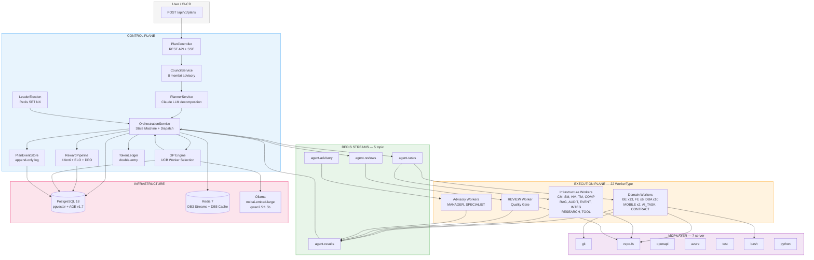

---

## 2. Control Plane — Architettura Interna

Dettaglio dei componenti del piano di controllo e le loro interazioni.

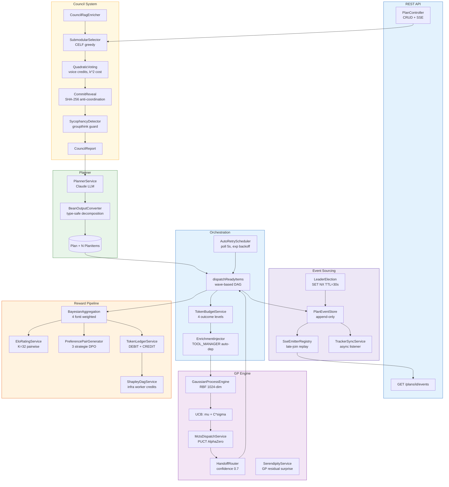

---

## 3. Worker Taxonomy — 22 WorkerType

Tutti i worker organizzati per categoria con profili e routing verso i Redis Streams.

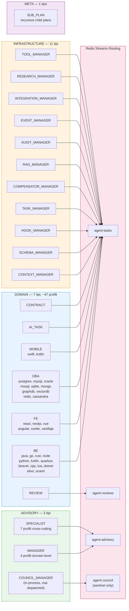

---

## 4. Redis Streams — Topologia Messaging

5 topic Redis Streams con producer, consumer groups e pattern QoS.

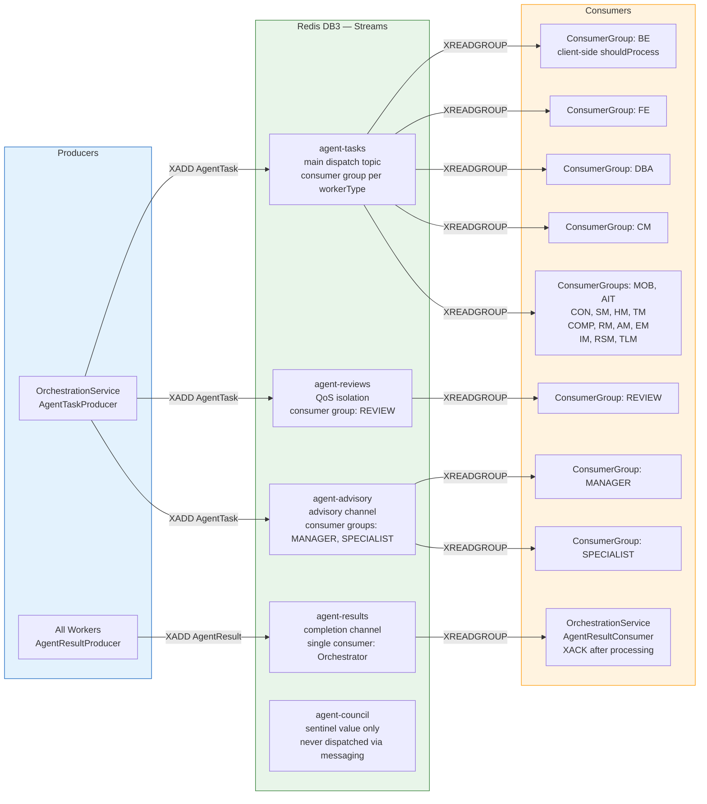

---

## 5. Dispatch Loop v2 — Dettaglio

Il ciclo di dispatch arricchito con GP Worker Selection, MCTS, Handoff Router, budget check e risk gate.

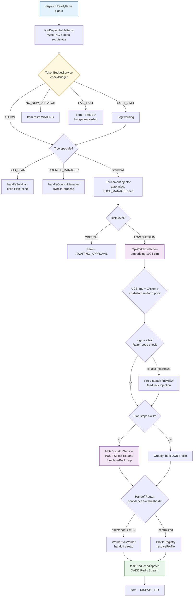

---

## 6. GP Engine + MCTS + DPO

Gaussian Process con kernel RBF, UCB selection, MCTS dispatch con PUCT, DPO pair generation e semantic cache.

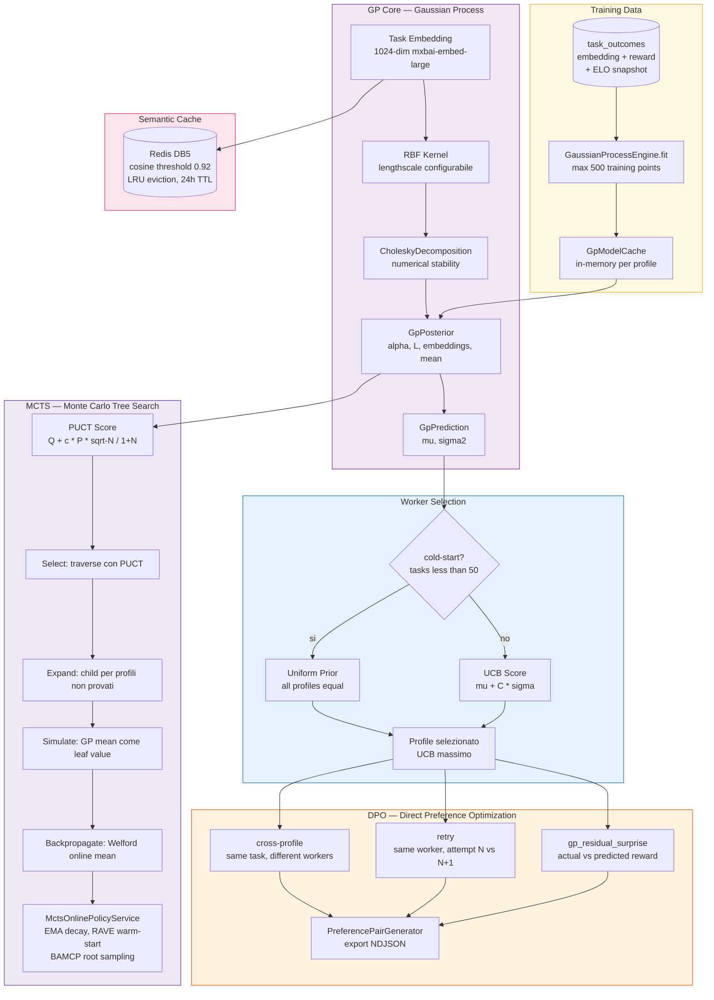

---

## 7. Council System — Deep Dive

Pre-planning advisory con selezione submodulare, Quadratic Voting, commit-reveal e guardie anti-groupthink.

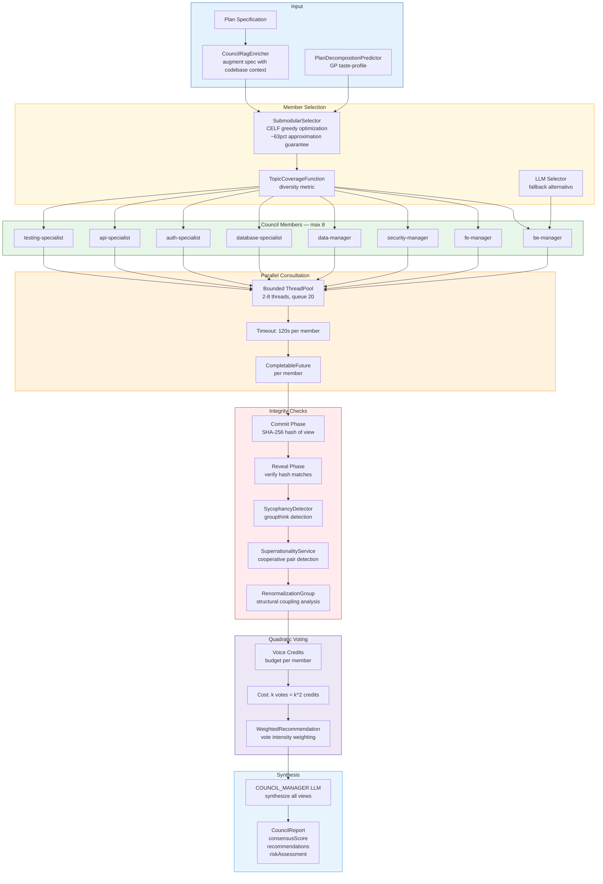

---

## 8. RAG Engine — Pipeline Completa

Ingestion, embedding, hybrid search con HyDE, RRF fusion, Graph RAG e cascade reranking.

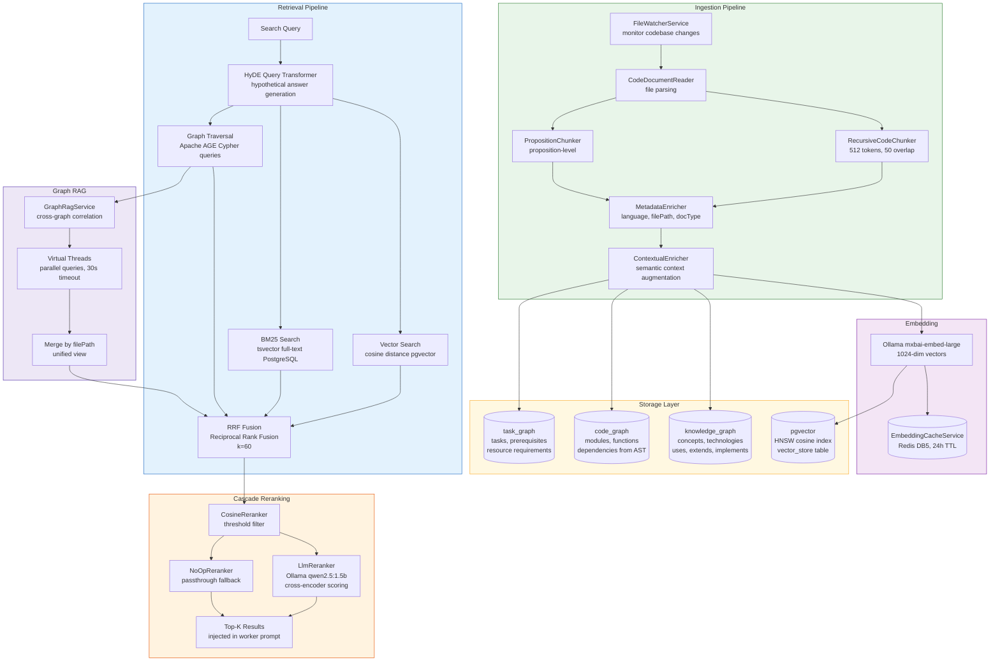

---

## 9. Reward Pipeline + Token Ledger

4 fonti di reward, aggregazione bayesiana, ELO rating, DPO pair generation e Token Ledger double-entry.

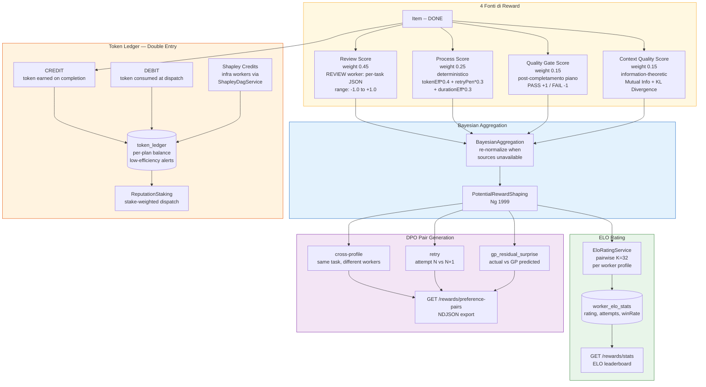

---

## 10. State Machine — Plan e Item Lifecycle

Tutte le transizioni di stato per Plan e PlanItem con i trigger che le causano.

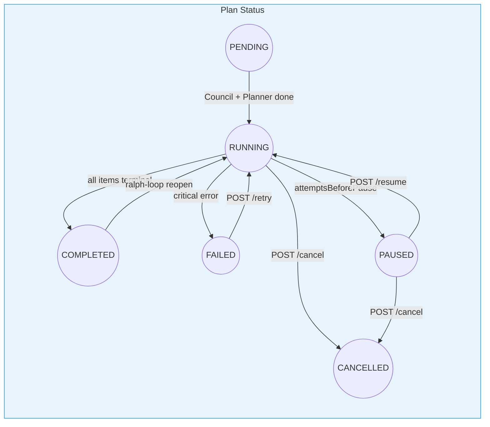

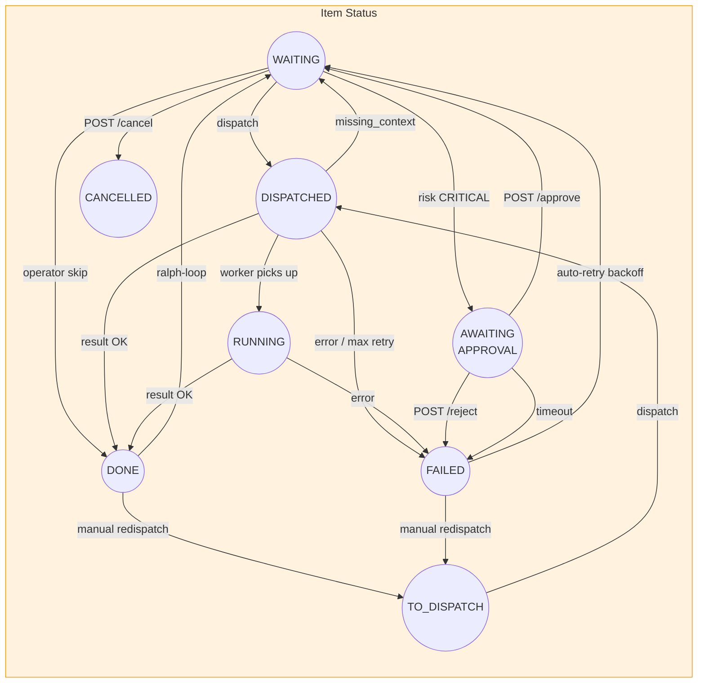

---

## 11. Analytics Services — Taxonomy (77+ servizi)

Tutti i servizi analytics organizzati per dominio teorico.

```mermaid
graph TD
    subgraph GAME["Game Theory — 10 servizi"]
        GT1[ShapleyValueService]
        GT2[ShapleyDagService]
        GT3[CausalShapleyService]
        GT4[MarkovShapleyService]
        GT5[VCGMechanismService]
        GT6[ContractTheoryService]
        GT7[ByzantineFaultToleranceService]
        GT8[SuperrationalityService]
        GT9[ReputationStakingService]
        GT10[VotingProtocolService]
    end

    subgraph FINANCE["Finance — 6 servizi"]
        FN1[RealOptionsService]
        FN2[ProspectTheoryService]
        FN3[HedgeAlgorithmService]
        FN4[ErgodicBudgetAnalyzer]
        FN5[ParetoDispatchOptimizer]
        FN6[PotentialRewardShapingService]
    end

    subgraph INFO["Information Theory — 9 servizi"]
        IT1[FisherInformationService]
        IT2[MDLService]
        IT3[InformationBottleneckService]
        IT4[BocpdService]
        IT5[ActiveInferenceService]
        IT6[InformationDirectedSamplingService]
        IT7[InformationForagingService]
        IT8[BayesianSurpriseService]
        IT9[ValueOfInformationService]
    end

    subgraph CTRL["Control Theory — 5 servizi"]
        CT1[ModelPredictiveControlService]
        CT2[HInfinityRobustService]
        CT3[CurriculumPromptingService]
        CT4[ConvergenceMonitor]
        CT5[ContextWindowManager]
    end

    subgraph FORMAL["Formal Methods — 9 servizi"]
        FM1[LTLPolicyVerifier]
        FM2[PetriNetAnalyzer]
        FM3[CSPChannelVerifier]
        FM4[CompressedSensingRetriever]
        FM5[PACBayesService]
        FM6[FunctorialSemanticsService]
        FM7[DescriptionLogicMatcher]
        FM8[StateMachineVerifier]
        FM9[FixedPointAnalyzer]
    end

    subgraph COMPLEX["Complex Systems — 6 servizi"]
        CS1[SpinGlassDispatchService]
        CS2[StigmergyCoordinator]
        CS3[ReplicatorDynamicsService]
        CS4[EdgeOfChaosService]
        CS5[RenormalizationGroupService]
        CS6[PersistentHomologyService]
    end

    subgraph SAFETY["Meta / Safety — 5 servizi"]
        MS1[SycophancyDetectorService]
        MS2[GoodhartDetectorService]
        MS3[ProcessMiningService]
        MS4[SelfRefineGateService]
        MS5[IteratedAmplificationService]
    end

    subgraph DISP["Dispatch — 6 servizi"]
        DS1[MctsDispatchService]
        DS2[MctsOnlinePolicyService]
        DS3[HandoffRouterService]
        DS4[ThompsonSamplingSelector]
        DS5[ReflectiveDispatchService]
        DS6[PlanArchetypeRegistry]
    end

    subgraph OBS["Observability — 10 servizi"]
        OB1[SemanticCacheService]
        OB2[CalibrationAuditService]
        OB3[WorkerDriftMonitor]
        OB4[CouncilDiversityService]
        OB5[SliDefinitionService]
        OB6[SloTracker]
        OB7[ErrorBudgetCalculator]
        OB8[QueuingCapacityPlanner]
        OB9[DecisionTraceService]
        OB10[TaskTypeClassifier]
    end

    subgraph RESIL["Resilience — 8 servizi"]
        RE1[RecoveryRouterService]
        RE2[SandboxExecutionService]
        RE3[MastClassifierService]
        RE4[SelfHealingRouter]
        RE5[ActorModelSupervisor]
        RE6[ChandyLamportSnapshotter]
        RE7[FactorisedBeliefService]
        RE8[ProcessRewardModelService]
    end

    style GAME fill:#e8f4fd,stroke:#2196F3
    style FINANCE fill:#fff8e1,stroke:#F9A825
    style INFO fill:#f3e5f5,stroke:#7B1FA2
    style CTRL fill:#e3f2fd,stroke:#1565C0
    style FORMAL fill:#ede7f6,stroke:#512DA8
    style COMPLEX fill:#fce4ec,stroke:#E91E63
    style SAFETY fill:#ffebee,stroke:#C62828
    style DISP fill:#e8f5e9,stroke:#2E7D32
    style OBS fill:#fff3e0,stroke:#FF9800
    style RESIL fill:#e0f2f1,stroke:#00695C
```

---

## 12. MCP Layer — Tool Access Control

7 MCP server con deny-all baseline, policy a 2 livelli e enforcement runtime.

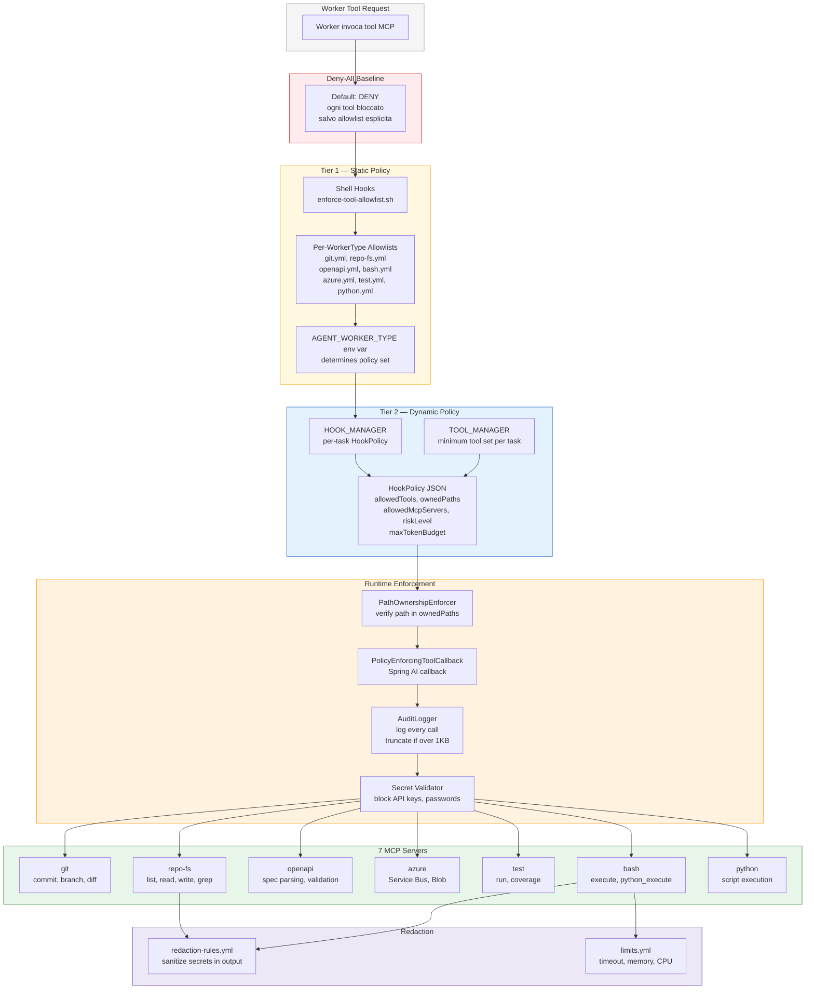

---

## 13. Event Sourcing + Leader Election + SSE

Hybrid event sourcing con leader election guard, late-join replay e tracker sync.

```mermaid
graph LR
    subgraph LEADER_SYS["Leader Election"]
        REDIS_L[(Redis<br/>orchestrator:leader)]
        SET_NX["SET NX + TTL 30s<br/>heartbeat ogni 10s"]
        ACQ[LeaderAcquiredEvent<br/>start consumers]
        LOST[LeaderLostEvent<br/>stop consumers]
        DEMOTE["Conservative demotion<br/>on Redis unavailability"]
    end

    subgraph EVENT_STORE_S["Event Store"]
        APPEND[PlanEventStore<br/>append-only log]
        SEQ[planId + sequenceNumber<br/>monotonic ordering]
        GUARD["Leader guard<br/>only leader appends"]
    end

    subgraph SPRING_EV["Spring Events"]
        PUB[ApplicationEventPublisher]
        CREATED[PlanCreatedEvent]
        DISPATCHED_E[PlanItemDispatchedEvent]
        COMPLETED_E[PlanItemCompletedEvent]
        SIDE_OK[TaskCompletedSideEffectEvent]
        SIDE_FAIL[TaskFailedSideEffectEvent]
    end

    subgraph SSE_SYS["SSE Streaming"]
        REG[SseEmitterRegistry]
        REPLAY["Late-join replay<br/>from store by sequenceNumber"]
        LIVE[Live broadcast<br/>to connected clients]
        ENDPOINT["GET /plans/id/events<br/>Last-Event-ID support"]
    end

    subgraph TRACKER_SYS["Tracker Sync"]
        TSYNC[TrackerSyncService<br/>@Async @EventListener]
    end

    SET_NX --> REDIS_L
    REDIS_L --> ACQ
    REDIS_L --> LOST
    REDIS_L --> DEMOTE
    ACQ --> GUARD
    GUARD --> APPEND
    APPEND --> SEQ
    APPEND --> PUB
    PUB --> CREATED
    PUB --> DISPATCHED_E
    PUB --> COMPLETED_E
    PUB --> SIDE_OK
    PUB --> SIDE_FAIL
    CREATED --> REG
    DISPATCHED_E --> REG
    COMPLETED_E --> REG
    REG --> REPLAY
    REG --> LIVE
    LIVE --> ENDPOINT
    REPLAY --> ENDPOINT
    COMPLETED_E --> TSYNC

    style LEADER_SYS fill:#ffebee,stroke:#C62828
    style EVENT_STORE_S fill:#e3f2fd,stroke:#1565C0
    style SPRING_EV fill:#e8f5e9,stroke:#2E7D32
    style SSE_SYS fill:#fff8e1,stroke:#F9A825
    style TRACKER_SYS fill:#f3e5f5,stroke:#7B1FA2
```

---

## 14. Error Handling + Resilienza

Auto-retry, missing-context loop, saga compensation, approval workflow, ralph-loop e SUB_PLAN recursion.

```mermaid
graph TD
    subgraph AUTO_RETRY["Auto-Retry con Exponential Backoff"]
        FAIL_I[Item FAILED] -->|"delay = base * 2^attempt<br/>jitter +/-25pct"| SCHEDULE[nextRetryAt = now + delay]
        SCHEDULE --> PAUSE_CHK{"attempts >=<br/>attemptsBeforePause?"}
        PAUSE_CHK -->|no| WAIT_R[Item resta FAILED<br/>con nextRetryAt]
        PAUSE_CHK -->|si| PAUSE_P[Plan -- PAUSED<br/>+ PLAN_PAUSED event]
        WAIT_R --> SCHED_P[AutoRetryScheduler<br/>poll ogni 5s]
        SCHED_P -->|"nextRetryAt <= now"| RETRY_I["retryFailedItem<br/>FAILED -- WAITING"]
        RETRY_I --> REDISP[dispatchReadyItems]
        PAUSE_P -->|"POST /resume"| RESUME_P["PAUSED -- RUNNING"]
        RESUME_P --> REDISP
    end

    subgraph MISSING_CTX["Missing-Context Feedback Loop"]
        W_MISS[Worker segnala<br/>missing_context] --> EXTRACT[extractMissingContext]
        EXTRACT --> NEW_CM[Crea task CM/TM<br/>per contesto mancante]
        NEW_CM -->|addDependency| ORIG[Item originale<br/>contextRetryCount++]
        ORIG -->|"DISPATCHED -- WAITING"| REQUEUE[Re-entra in dispatch queue]
        NEW_CM -->|dispatch| CM_W[CONTEXT_MANAGER]
        CM_W -->|DONE| DEPS_OK[deps soddisfatte]
        DEPS_OK --> REDISP_2[Re-dispatch item originale]
    end

    subgraph SAGA["Saga Compensation"]
        COMP_TRIG["POST /compensate"] --> COMP_W[COMPENSATOR_MANAGER<br/>analizza fallimento]
        COMP_W --> GIT_REV[git revert<br/>file restore]
        GIT_REV --> NEW_ITEMS[Nuovi PlanItem correttivi]
        NEW_ITEMS --> REOPEN[Piano riaperto<br/>con nuovi items]
    end

    subgraph APPROVAL["Human-in-the-Loop"]
        HM_RISK[HOOK_MANAGER<br/>riskLevel = CRITICAL] --> AWAIT_A["Item -- AWAITING_APPROVAL"]
        AWAIT_A -->|"POST /approve"| APPROVE_A["WAITING + triggerDispatch"]
        AWAIT_A -->|"POST /reject"| REJECT_A["FAILED + failureReason"]
        AWAIT_A -->|timeout| TIMEOUT_A[FAILED]
    end

    subgraph RALPH["Ralph-Loop Quality Gate"]
        QG_FAIL[Quality Gate failure] --> FEEDBACK[feedback injection<br/>in item context]
        FEEDBACK -->|"DONE -- WAITING"| REDO[Re-dispatch con feedback]
        REDO --> MAX_CHK{"loops >= maxRalphLoops?<br/>default: 2"}
        MAX_CHK -->|no| REDISP_3[dispatch con feedback]
        MAX_CHK -->|si| ACCEPT[Accetta risultato corrente]
    end

    subgraph SUB_PLAN_S["SUB_PLAN Recursion"]
        PARENT[Parent Plan<br/>depth=0] -->|contiene| SP_ITEM[PlanItem SUB_PLAN]
        SP_ITEM --> DEPTH{"depth less than maxDepth?"}
        DEPTH -->|si| CHILD[Child Plan<br/>depth=1]
        DEPTH -->|no| DEPTH_FAIL["FAILED: max depth exceeded"]
        CHILD -->|"tutti items DONE"| CHILD_OK[parent item -- DONE]
        CHILD -->|"qualche item FAILED"| CHILD_FAIL[parent item -- FAILED]
    end

    style AUTO_RETRY fill:#fff3e0,stroke:#FF9800
    style MISSING_CTX fill:#e3f2fd,stroke:#1565C0
    style SAGA fill:#ffebee,stroke:#C62828
    style APPROVAL fill:#fff8e1,stroke:#F9A825
    style RALPH fill:#e8f5e9,stroke:#2E7D32
    style SUB_PLAN_S fill:#ede7f6,stroke:#512DA8
```

---

## 15. Infrastructure e Data Layer

PostgreSQL 18 con 42 Flyway migrations raggruppate, Redis multi-DB e Ollama.

```mermaid
graph TD
    subgraph PG_SYS["PostgreSQL 18 — pgvector + AGE v1.7.0"]
        subgraph CORE_T["Core V1-V4"]
            T_PLAN[plans]
            T_ITEMS[plan_items + deps]
            T_EVENTS[plan_event]
            T_FEEDBACK[quality_gate_feedback]
        end

        subgraph RAG_T["RAG V5-V6"]
            T_VECTOR[vector_store<br/>HNSW cosine 1024-dim]
            T_KG[knowledge_graph<br/>Apache AGE]
            T_CG[code_graph<br/>Apache AGE]
            T_TG[task_graph<br/>Apache AGE]
        end

        subgraph GP_T["GP/DPO V7-V12"]
            T_QGF[quality_gate_feedback<br/>Ralph-Loop V7]
            T_OUTCOMES[task_outcomes<br/>embedding + reward V8]
            T_DPO_R[dpo_gp_residual V9]
            T_SEREN[serendipity V10]
            T_OPTLOCK[optimistic_locking V11]
            T_BAYES[bayesian_success V12]
        end

        subgraph BUDGET_T["Budget V13, V24"]
            T_COST[task_cost_tracking V13]
            T_LEDGER[token_ledger<br/>DEBIT + CREDIT V24]
        end

        subgraph SEC_T["Security V27-V33"]
            T_HASH[hash_chain V27]
            T_POLHASH[policy_hash V28]
            T_WKEYS[worker_keys V29]
            T_REPSTK[reputation_staking V30]
            T_PROMPT[prompt_hash V31]
            T_MERKLE[merkle_dag V32]
            T_COMMIT_T[council_commitments V33]
        end

        subgraph OPS_T["Operational V14-V22"]
            T_HINTS[tool_hints V14]
            T_ARTIFACT[artifact_store V15]
            T_WORKSPACE[workspace_volume V16]
            T_MODEL[plan_item_model_id V18]
            T_COMPMODE[compensation_mode V19]
            T_AUDIT_T[audit_events V20]
            T_CONV[conversation_log V21]
            T_FILEMODS[file_modifications V22]
        end

        subgraph ADV_T["Advanced V23-V42"]
            T_CTX_Q[context_quality V23]
            T_SHAPLEY[shapley_value V25]
            T_SPLIT[task_auto_split V26]
            T_EXEC[execution_runtime V34]
            T_GITSAFE[git_safety V35]
            T_COMPILE[compile_test_fix V36]
            T_XPLAN[cross_plan_knowledge V37]
            T_SELFIMP[self_improving V38]
            T_INTHUB[integration_hub V39]
            T_ELICIT[elicitation V40]
            T_LIFECYCLE[project_lifecycle V41]
            T_BENCH[effectiveness_benchmark V42]
        end
    end

    subgraph REDIS_SYS["Redis 7"]
        RDB3["DB3 — Streams<br/>agent-tasks, agent-results<br/>agent-reviews, agent-advisory"]
        RDB5["DB5 — Semantic Cache<br/>embedding cache 24h TTL<br/>GP model cache<br/>cosine threshold 0.92"]
    end

    subgraph OLLAMA_SYS["Ollama"]
        OLL_EMB["mxbai-embed-large<br/>1024-dim embeddings<br/>ingestion + search"]
        OLL_RANK["qwen2.5:1.5b<br/>cross-encoder reranker<br/>cascade reranking"]
    end

    T_VECTOR --> OLL_EMB
    T_OUTCOMES --> OLL_EMB
    RDB5 --> OLL_EMB
    T_VECTOR --> OLL_RANK

    style PG_SYS fill:#e3f2fd,stroke:#1565C0
    style CORE_T fill:#e8f4fd,stroke:#90CAF9
    style RAG_T fill:#f3e5f5,stroke:#CE93D8
    style GP_T fill:#fff8e1,stroke:#FFE082
    style BUDGET_T fill:#fff3e0,stroke:#FFCC80
    style SEC_T fill:#ffebee,stroke:#EF9A9A
    style OPS_T fill:#e8f5e9,stroke:#A5D6A7
    style ADV_T fill:#ede7f6,stroke:#B39DDB
    style REDIS_SYS fill:#fce4ec,stroke:#E91E63
    style OLLAMA_SYS fill:#e0f2f1,stroke:#00695C
```

---

## 16. Sequenza End-to-End — Lifecycle di un Piano

Flusso temporale completo dal POST API al PLAN_COMPLETED.

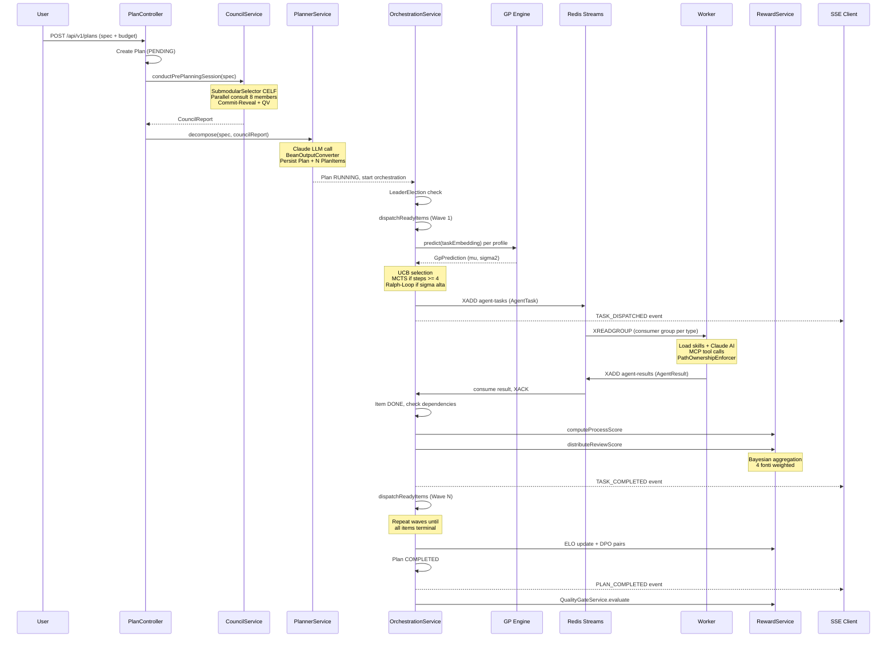

---

> **Nota**: Questo documento sostituisce il [diagramma architetturale v1](/agent-framework/architecture/architecture-diagram) che rifletteva lo stato S4-S5 del framework. Il v1 resta disponibile come riferimento storico.
