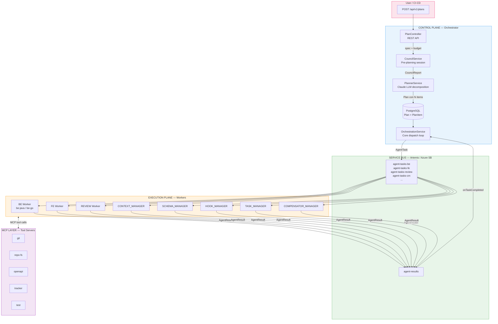
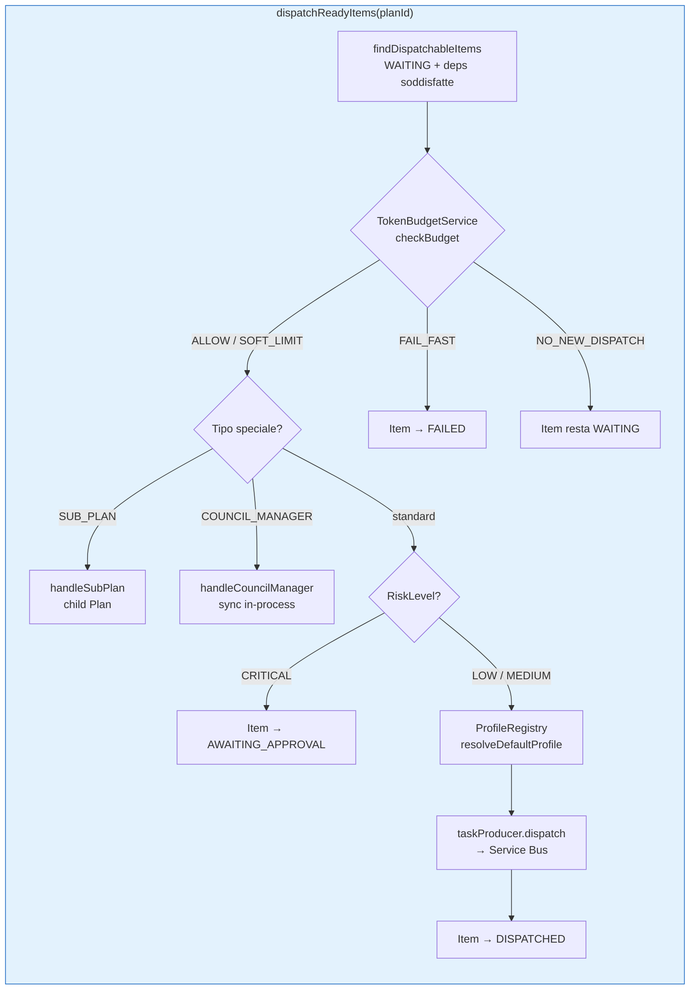
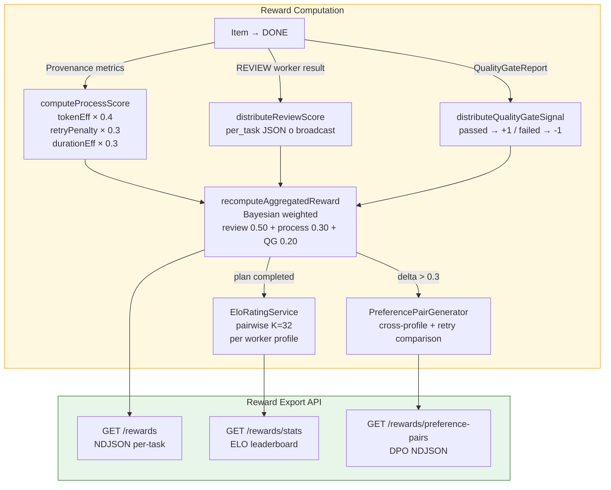
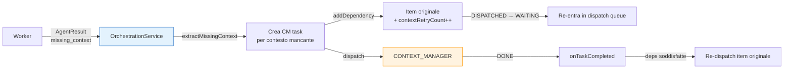
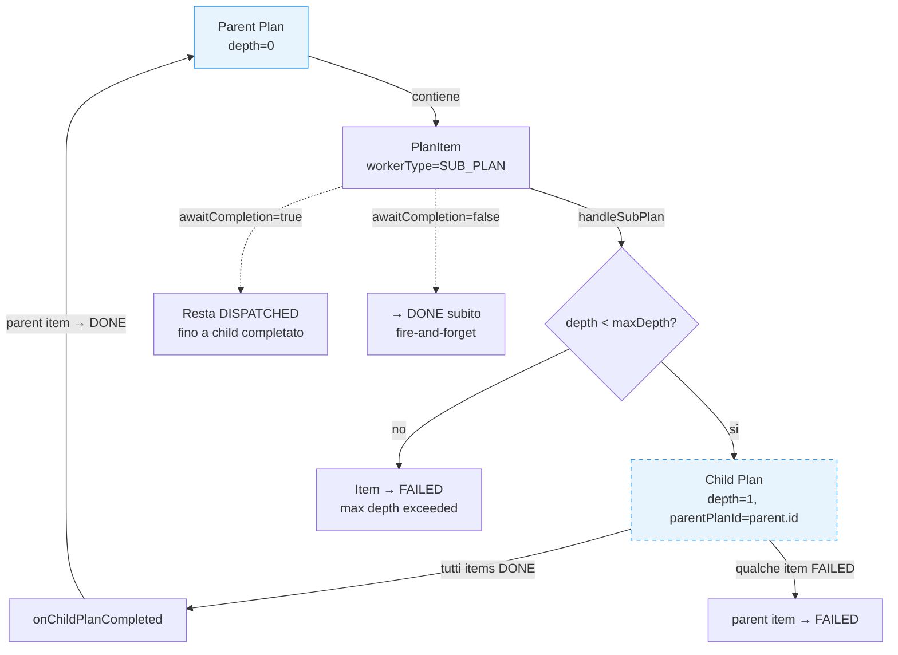
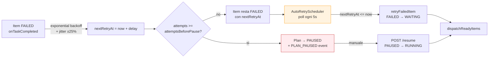
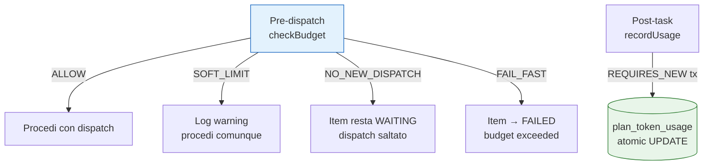
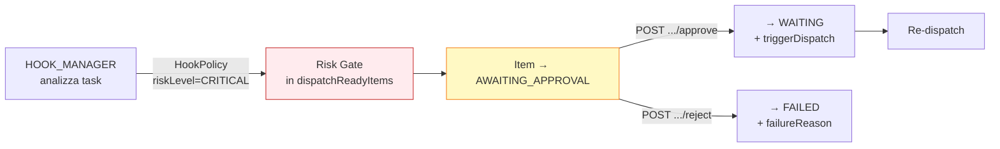

# Diagramma Architetturale — Agent Framework

## Flusso Principale di Orchestrazione



## Dispatch Loop — Dettaglio



## Reward Pipeline



## Event Sourcing + SSE

```mermaid
graph LR
    subgraph EVENTS["Hybrid Event Sourcing"]
        ORCH_EV[OrchestrationService<br/>state transitions]
        STORE[(PlanEventStore<br/>append-only log<br/>planId + sequenceNumber)]
        SPRING[SpringPlanEvent<br/>ApplicationEvent]
        SSE[SseEmitterRegistry<br/>late-join replay<br/>+ live broadcast]
        TRACKER_SYNC[TrackerSyncService<br/>@Async @EventListener<br/>TODO: MCP tracker call]
        CLIENT[Browser / UI<br/>GET /plans/id/events]

        ORCH_EV -->|append| STORE
        ORCH_EV -->|publishEvent| SPRING
        SPRING --> SSE
        SPRING -->|async| TRACKER_SYNC
        CLIENT -->|subscribe| SSE
        SSE -->|replay from| STORE
    end

    style EVENTS fill:#ede7f6,stroke:#512DA8
```

## Missing-Context Feedback Loop



## SUB_PLAN Recursion



## Auto-Retry + Pause



## Token Budget Enforcement



## Approval Workflow (AWAITING_APPROVAL)


